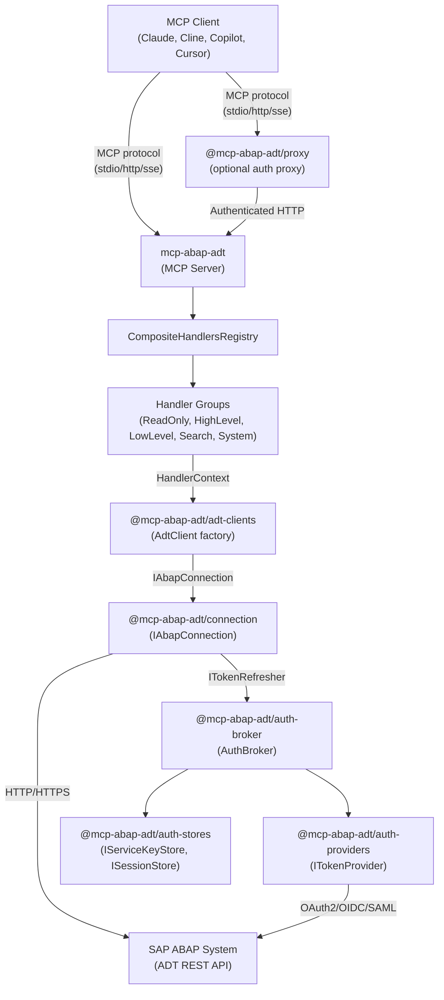

# MCP ABAP ADT -- System Architecture

This document provides a comprehensive architectural description of the **mcp-abap-adt** system: a multi-component, interface-driven TypeScript platform that enables AI assistants to interact with SAP ABAP systems through the ADT (ABAP Development Tools) REST API via the Model Context Protocol (MCP).

---

## 1. Architectural Principles

### 1.1 Interface-Only Communication (IOC)

All inter-package communication occurs exclusively through TypeScript interfaces defined in `@mcp-abap-adt/interfaces`. No package imports concrete implementations from another package. This is not a guideline -- it is an enforced architectural invariant.

```typescript
// Correct -- depends on interface only
import type { ISessionStore } from '@mcp-abap-adt/interfaces';

// Prohibited -- creates concrete coupling
import { AbapSessionStore } from '@mcp-abap-adt/auth-stores';
```

### 1.2 Dependency Inversion

All high-level modules depend on abstractions (interfaces), not on low-level implementations. Concrete implementations are injected at the composition root (`launcher.ts` in the main server). This ensures that every component can be tested in isolation and replaced without modifying consumers.

### 1.3 Replaceable Default Implementations

Every interface shipped with the system has at least one default implementation. Consumers are free to substitute any default with a custom implementation that satisfies the same interface contract. The system makes no assumptions beyond what interfaces specify.

### 1.4 Separation of Concerns

Each package owns exactly one responsibility:

| Concern | Package |
|:---|:---|
| Interface contracts | `@mcp-abap-adt/interfaces` |
| Logging abstraction | `@mcp-abap-adt/logger` |
| Header validation | `@mcp-abap-adt/header-validator` |
| Credential storage | `@mcp-abap-adt/auth-stores` |
| Token orchestration | `@mcp-abap-adt/auth-broker` |
| Token acquisition flows | `@mcp-abap-adt/auth-providers` |
| HTTP transport to SAP | `@mcp-abap-adt/connection` |
| ABAP object operations | `@mcp-abap-adt/adt-clients` |
| MCP protocol adapter | `mcp-abap-adt` (main server) |
| Authorization proxy | `@mcp-abap-adt/proxy` |
| Client configurator | `@mcp-abap-adt/configurator` |

### 1.5 Clear Runtime Contracts

Every public function and method operates against well-defined input/output types. Error conditions are expressed through typed error codes (`AdtObjectErrorCodes`, `TokenProviderErrorCodes`, `StoreErrorCodes`), not raw strings. This makes error handling deterministic across all consumers.

---

## 2. Component Catalogue

### 2.1 @mcp-abap-adt/interfaces

| Attribute | Value |
|:---|:---|
| **Responsibility** | Single source of truth for all TypeScript interfaces, types, enums, and error codes |
| **Dependencies** | None (base package) |
| **Replaceable** | N/A -- defines contracts, not implementations |
| **Runtime role** | Type-only at runtime (compile-time contracts) |

**Interface domains:**

| Domain | Key Interfaces | Purpose |
|:---|:---|:---|
| Connection | `IAbapConnection`, `IAbapRequestOptions`, `IAdtResponse` | HTTP communication with SAP ADT |
| Authentication | `IAuthorizationConfig`, `IConnectionConfig`, `IConfig` | Auth credential structures |
| Token | `ITokenProvider`, `ITokenResult`, `ITokenRefresher` | Token lifecycle management |
| Session | `ISessionStore`, `ISessionStorage`, `ISessionState` | Session persistence |
| Service Key | `IServiceKeyStore` | Service key access |
| ADT Objects | `IAdtObject<TConfig, TState>`, `IAdtObjectState`, `IAdtObjectConfig` | CRUD lifecycle for ABAP objects |
| Logging | `ILogger`, `LogLevel` | Structured logging |
| Validation | `IHeaderValidationResult`, `IValidatedAuthConfig` | Header analysis |
| SAP Config | `ISapConfig`, `SapAuthType` | SAP system configuration |
| Headers | `HEADER_*` constants, header group arrays | HTTP header contracts |

**Generic object model** -- every ABAP object type is modeled through two generic parameters:

- **`TConfig`** -- static metadata (name, package, description, transport request)
- **`TState extends IAdtObjectState`** -- accumulated operation results (read, create, lock, activate, errors)

This allows `IAdtObject<TConfig, TState>` to provide a uniform CRUD interface across all 22+ supported ABAP object types.

---

### 2.2 @mcp-abap-adt/logger

| Attribute | Value |
|:---|:---|
| **Responsibility** | Logging abstraction with two default implementations |
| **Public interface** | `ILogger` (info, error, warn, debug) |
| **Default implementations** | `DefaultLogger` (console-based), `PinoLogger` (structured, with fallback) |
| **Replaceable** | Yes -- any `ILogger` implementation accepted |
| **Runtime role** | Injected into all components that produce diagnostic output |
| **Dependencies** | `@mcp-abap-adt/interfaces`; `pino` as optional peer dependency |

`PinoLogger` dynamically loads `pino` at runtime. If pino is not installed, it silently falls back to `DefaultLogger`. Both implementations respect the `AUTH_LOG_LEVEL` environment variable and redact sensitive fields (passwords, tokens, authorization headers).

---

### 2.3 @mcp-abap-adt/header-validator

| Attribute | Value |
|:---|:---|
| **Responsibility** | Validates and normalizes incoming HTTP authorization headers |
| **Public interface** | `IHeaderValidationResult`, `IValidatedAuthConfig` |
| **Replaceable** | Yes |
| **Runtime role** | Used by HTTP/SSE transport servers to extract auth parameters from request headers |
| **Dependencies** | `@mcp-abap-adt/interfaces` |

Supports prioritized authentication methods:

| Priority | Method | Headers |
|:---|:---|:---|
| 4 (highest) | SAP Destination (AuthBroker) | `x-sap-destination` |
| 3 | MCP Destination + JWT | `x-mcp-destination` + `x-sap-auth-type=jwt` |
| 2 | Direct JWT | `x-sap-jwt-token` |
| 1 | Basic Auth | `x-sap-login` + `x-sap-password` |
| 0 | None | No valid auth |

---

### 2.4 @mcp-abap-adt/auth-stores

| Attribute | Value |
|:---|:---|
| **Responsibility** | Persistent storage for service keys and session data |
| **Public interfaces** | `IServiceKeyStore`, `ISessionStore` |
| **Default implementations** | `AbapServiceKeyStore`, `XsuaaServiceKeyStore`, `AbapSessionStore`, `XsuaaSessionStore` |
| **Replaceable** | Yes -- consumers can provide any `IServiceKeyStore` / `ISessionStore` |
| **Runtime role** | Supplies credentials and persists tokens between sessions |
| **Dependencies** | `@mcp-abap-adt/interfaces`, `dotenv` |

Service key stores read `{destination}.json` files from a configurable directory. Session stores persist authorization and connection configurations per destination. ABAP and XSUAA variants differ in JSON structure parsing, not in interface contract.

---

### 2.5 @mcp-abap-adt/auth-broker

| Attribute | Value |
|:---|:---|
| **Responsibility** | Token orchestration -- coordinates stores and providers to produce valid tokens |
| **Public interface** | `AuthBroker` class, `ITokenRefresher` factory |
| **Replaceable** | Yes -- any object satisfying the same method signatures |
| **Runtime role** | Central authentication coordinator; creates `ITokenRefresher` for injection into connections |
| **Dependencies** | `@mcp-abap-adt/interfaces` |

**Token acquisition flow** (multi-step with fallback):

```
1. Check session store for cached token
   └─ Valid? → return token
2. Attempt token refresh via refresh_token
   └─ Success? → persist to session store, return token
3. Fall back to browser-based OAuth2 authorization_code flow
   └─ Success? → persist to session store, return token
4. Fail with typed error (BROWSER_AUTH_REQUIRED, REFRESH_ERROR, etc.)
```

`AuthBroker` accepts three injected dependencies:

- `ISessionStore` (required) -- cached tokens and connection config
- `IServiceKeyStore` (optional) -- initial credentials from service key files
- `ITokenProvider` (required) -- handles actual token acquisition (browser OAuth, client credentials, etc.)

It also produces `ITokenRefresher` instances that are injected into `JwtAbapConnection` for transparent token renewal on 401/403 responses.

---

### 2.6 @mcp-abap-adt/auth-providers

| Attribute | Value |
|:---|:---|
| **Responsibility** | Concrete token acquisition strategies |
| **Public interface** | `ITokenProvider` (from interfaces package) |
| **Default implementations** | `AuthorizationCodeProvider`, `ClientCredentialsProvider`, `DeviceFlowProvider`, `OidcBrowserProvider`, `OidcDeviceFlowProvider`, `OidcPasswordProvider`, `OidcTokenExchangeProvider`, `Saml2BearerProvider`, `Saml2PureProvider` |
| **Replaceable** | Yes -- any `ITokenProvider` implementation |
| **Runtime role** | Injected into `AuthBroker` to perform specific OAuth2/OIDC/SAML flows |
| **Dependencies** | `@mcp-abap-adt/interfaces`, `axios`, `express`, `open` |

All providers extend `BaseTokenProvider` which manages token caching, expiration tracking, and the `getTokens()` lifecycle. Each provider implements a specific grant type:

| Provider | Grant Type | Use Case |
|:---|:---|:---|
| `AuthorizationCodeProvider` | `authorization_code` | Interactive browser-based BTP auth |
| `ClientCredentialsProvider` | `client_credentials` | Machine-to-machine, no user context |
| `DeviceFlowProvider` | `device_code` | Devices without browser |
| `OidcBrowserProvider` | OIDC + browser | Generic OIDC with browser |
| `OidcDeviceFlowProvider` | OIDC + device | Generic OIDC without browser |
| `OidcPasswordProvider` | `password` | Resource owner password (legacy) |
| `OidcTokenExchangeProvider` | `token_exchange` | Token exchange flows |
| `Saml2BearerProvider` | `saml2_bearer` | SAML2 bearer assertion |
| `Saml2PureProvider` | Pure SAML | Direct SAML authentication |

---

### 2.7 @mcp-abap-adt/connection

| Attribute | Value |
|:---|:---|
| **Responsibility** | HTTP transport layer to SAP ADT REST API |
| **Public interface** | `IAbapConnection` |
| **Default implementations** | `BaseAbapConnection` (Basic auth), `JwtAbapConnection` (JWT/BTP), `SamlAbapConnection` (SAML) |
| **Replaceable** | Yes -- any `IAbapConnection` implementation |
| **Runtime role** | Executes HTTP requests against SAP ADT endpoints |
| **Dependencies** | `@mcp-abap-adt/interfaces`, `axios` |

**Factory function:**

```typescript
createAbapConnection(config: SapConfig, logger?: ILogger, sessionId?: string, tokenRefresher?: ITokenRefresher): IAbapConnection
```

Automatically selects the correct implementation based on `config.authType` (`basic`, `jwt`, or `saml`).

**Key capabilities:**
- CSRF token management (automatic fetch, cache, refresh on error)
- Stateful/stateless session switching via `sap-contextid` headers
- Cookie management for session persistence
- Automatic token refresh on 401/403 via injected `ITokenRefresher`
- TLS configuration respecting `NODE_TLS_REJECT_UNAUTHORIZED`
- Retry logic for transient errors

---

### 2.8 @mcp-abap-adt/adt-clients

| Attribute | Value |
|:---|:---|
| **Responsibility** | Domain logic for ABAP object CRUD operations |
| **Public interface** | `IAdtObject<TConfig, TState>` per object type |
| **Default implementation** | `AdtClient` (factory), 22+ object-type handlers |
| **Replaceable** | Yes -- via interface |
| **Runtime role** | Called by MCP tool handlers to perform SAP operations |
| **Dependencies** | `@mcp-abap-adt/interfaces`, `@mcp-abap-adt/logger`, `fast-xml-parser` |

**AdtClient** is a factory that creates typed object handlers:

```typescript
const client = new AdtClient(connection, logger);
const program = client.getProgram();     // → IAdtObject<IProgramConfig, IProgramState>
const cls = client.getClass();           // → IAdtObject<IClassConfig, IClassState>
const func = client.getFunctionModule(); // → IAdtObject<IFunctionModuleConfig, IFunctionModuleState>
```

**Supported ABAP object types** (22+): Class, Program, Interface, Domain, DataElement, Structure, Table, TableType, View, FunctionGroup, FunctionModule, Package, ServiceDefinition, BehaviorDefinition, BehaviorImplementation, MetadataExtension, Enhancement, UnitTest, CdsUnitTest, Transport Request, LocalDefinitions, LocalTypes, LocalMacros, LocalTestClass.

**Operation chains** -- create and update operations are multi-step sequences:

```
Create: validate → create → check → lock → update → unlock → check → activate (optional)
Update: lock → check → update → unlock → check → activate (optional)
Delete: check(deletion) → delete
Read:   single GET request
```

Each step accumulates results in `TState`, providing full audit trail of the operation.

**AdtUtils** provides cross-cutting utilities: repository search, where-used analysis, package hierarchy traversal, table content queries, inactive object lists, and batch operations.

---

### 2.9 mcp-abap-adt (Main MCP Server)

| Attribute | Value |
|:---|:---|
| **Responsibility** | MCP protocol adapter -- translates MCP tool calls into ADT client operations |
| **Runtime role** | Primary application entry point; composition root |
| **Transport modes** | `stdio`, `streamable-http`, `sse` |
| **Dependencies** | All packages above + `@modelcontextprotocol/sdk`, `zod` |

#### Composition Root

`src/server/launcher.ts` is the composition root where all dependencies are wired:

```
launcher.ts main()
  ├── ServerConfigManager.getConfig()         // CLI args, YAML, env vars
  ├── Create handler groups (by exposition)   // ReadOnly, HighLevel, LowLevel, Search, System
  ├── CompositeHandlersRegistry(groups)       // Aggregate registry
  ├── AuthBrokerFactory                       // Per-destination auth broker management
  └── Transport server (Stdio|Http|Sse)       // Start appropriate transport
```

#### Handler Architecture

Handlers are organized into groups by access level:

| Group | Purpose | Typical Tool Count |
|:---|:---|:---|
| `ReadOnlyHandlersGroup` | Get operations (read source, metadata) | ~10 |
| `HighLevelHandlersGroup` | Full CRUD (Create, Update, Delete, Get) | ~90 |
| `LowLevelHandlersGroup` | Fine-grained (lock, unlock, activate, validate) | ~40 |
| `SearchHandlersGroup` | Repository search, where-used | ~5 |
| `SystemHandlersGroup` | System info, discovery | ~3 |

The `exposition` configuration controls which groups are active, enabling read-only deployments or full-access modes.

**Handler registration flow:**

```
CompositeHandlersRegistry
  └── for each IHandlerGroup:
        └── BaseHandlerGroup.registerHandlers(server)
              └── for each HandlerEntry:
                    ├── Convert JSON Schema → Zod
                    ├── Wrap handler with context injection
                    └── server.registerTool(name, schema, wrappedHandler)
```

Each handler follows a uniform pattern:

```typescript
// Tool definition (static metadata)
export const TOOL_DEFINITION = {
  name: "GetProgram",
  description: "Retrieve ABAP program source code",
  inputSchema: { type: "object", properties: { program_name: { type: "string" } }, required: ["program_name"] }
} as const;

// Handler function (receives injected context)
export async function handleGetProgram(context: HandlerContext, args: GetProgramArgs) {
  const client = new AdtClient(context.connection, context.logger);
  const result = await client.getProgram().read({ programName: args.program_name }, args.version || 'active');
  return return_response(result);
}
```

`HandlerContext` contains the `IAbapConnection` and optional `ILogger` -- injected per-request by `BaseMcpServer`.

#### Transport Servers

| Transport | Class | Connection Model | Session Management |
|:---|:---|:---|:---|
| stdio | `StdioServer` | Cached (one per server lifetime) | Single persistent session |
| HTTP | `StreamableHttpServer` | Per-request (new server instance) | Stateless |
| SSE | `SseServer` | Per-connection | Map by session ID |

All transports extend `BaseMcpServer` which handles handler registration, connection context management, and per-request context injection.

---

### 2.10 @mcp-abap-adt/proxy (Auxiliary Utility)

| Attribute | Value |
|:---|:---|
| **Responsibility** | Authorization proxy between MCP clients and remote MCP servers on BTP |
| **Architectural relationship** | Fully independent -- can proxy to ANY MCP server, not just mcp-abap-adt |
| **Runtime role** | Intercepts requests, obtains JWT via XSUAA, forwards authenticated requests |
| **Transport modes** | `stdio`, `streamable-http`, `sse` |
| **Dependencies** | `@mcp-abap-adt/auth-broker`, `@mcp-abap-adt/auth-providers`, `@mcp-abap-adt/auth-stores`, `@mcp-abap-adt/interfaces`, `@modelcontextprotocol/sdk`, `axios` |

The proxy is **not** part of the main server's runtime. It is a standalone utility for scenarios where MCP clients (Cline, Copilot, Cursor) cannot perform BTP authentication directly.

**Key capabilities:**
- JWT token management with 30-minute cache TTL
- Multi-destination support (per-destination auth brokers)
- Circuit breaker pattern for resilience
- Retry with exponential backoff
- Service key-based MCP server URL discovery
- Request/response logging with sensitive data redaction
- Eager authentication (browser opens on startup for stdio mode)

---

### 2.11 @mcp-abap-adt/configurator (Auxiliary Utility)

| Attribute | Value |
|:---|:---|
| **Responsibility** | Automates MCP server registration in client configuration files |
| **Architectural relationship** | Fully independent -- no runtime dependency on any other package |
| **Supported clients** | Cline, Claude, Codex, Cursor, Copilot, Goose, Windsurf, OpenCode, Antigravity, Qwen, Crush (11 total) |
| **Operations** | add, rm, ls, show, enable, disable, where, update, tui |

A pure CLI/TUI tool that handles platform-specific and client-specific configuration file formats (JSON, YAML, TOML) across global and project scopes.

---

## 3. Submodule Clarification

Each package is an **independent git repository** with its own version, build pipeline, test suite, and npm publication. For development convenience, packages can be aggregated using **git submodules**:

```
mcp-abap-adt/              ← Own git repo, published to npm
mcp-abap-adt-interfaces/   ← Own git repo, published to npm
mcp-abap-adt-clients/      ← Own git repo, published to npm
mcp-abap-connection/       ← Own git repo, published to npm
...                        ← Each package is independent
```

**Critical distinction:**

- **Submodules are purely administrative** -- they enable synchronized development and convenient cross-package navigation, but are not required
- **Architectural isolation remains intact** -- each package has its own `package.json`, version, build pipeline, test suite, and npm publication
- **Submodule grouping does not equal monolith** -- consuming packages individually from npm changes nothing architecturally
- **No package references another package's source code** -- all inter-package dependencies go through npm-published interfaces

---

## 4. Runtime Interaction Model

### 4.1 High-Level Component Interaction



### 4.2 Request Processing Flow (HTTP Transport)

```
1. HTTP POST /mcp/stream/http
   └── StreamableHttpServer.createRequestHandler()

2. Per-request server creation
   └── new BaseMcpServer() instance per request

3. Connection context resolution
   ├── From x-mcp-destination header → AuthBrokerFactory.getBroker(destination)
   ├── From x-sap-url + auth headers → Direct connection params
   └── From default destination (startup config)

4. Handler invocation
   ├── BaseMcpServer resolves tool name → handler function
   ├── Creates HandlerContext { connection: IAbapConnection, logger: ILogger }
   └── Calls handler(context, args)

5. ADT operation execution
   ├── Handler creates AdtClient(connection, logger)
   ├── Calls typed operation (e.g., client.getProgram().read(...))
   ├── AdtClient delegates to IAbapConnection.makeAdtRequest()
   └── Connection handles auth, CSRF, retries, session

6. Response
   └── Handler returns MCP-formatted response (text content)
```

### 4.3 Inversion of Control Boundaries

The system has three distinct IoC boundaries:

| Boundary | What is Inverted | Composition Point |
|:---|:---|:---|
| **Auth** | Token acquisition strategy | `AuthBroker` constructor receives `ITokenProvider`, `ISessionStore`, `IServiceKeyStore` |
| **Transport** | HTTP communication with SAP | `AdtClient` constructor receives `IAbapConnection` |
| **Handlers** | Tool behavior per transport/mode | `CompositeHandlersRegistry` receives `IHandlerGroup[]` |

### 4.4 Composition Root Location

`mcp-abap-adt/src/server/launcher.ts` is the single composition root for the main server. It:

1. Reads configuration (CLI, YAML, env)
2. Instantiates concrete store implementations (`AbapServiceKeyStore`, `AbapSessionStore`)
3. Creates token providers (`AuthorizationCodeProvider`)
4. Assembles `AuthBroker` instances via `AuthBrokerFactory`
5. Creates handler groups with `HandlerContext`
6. Assembles `CompositeHandlersRegistry`
7. Starts the appropriate transport server

No other file in the system creates concrete cross-package dependencies.

---

## 5. Extensibility Model

### 5.1 Replacing Default Implementations

Any interface-backed component can be replaced. The general pattern:

```typescript
// 1. Implement the interface
class CustomSessionStore implements ISessionStore {
  async loadSession(destination: string): Promise<IConfig | null> { /* custom logic */ }
  async saveSession(destination: string, config: IConfig): Promise<void> { /* custom logic */ }
  async getAuthorizationConfig(destination: string): Promise<IAuthorizationConfig | null> { /* ... */ }
  async getConnectionConfig(destination: string): Promise<IConnectionConfig | null> { /* ... */ }
  async setAuthorizationConfig(destination: string, config: IAuthorizationConfig): Promise<void> { /* ... */ }
  async setConnectionConfig(destination: string, config: IConnectionConfig): Promise<void> { /* ... */ }
}

// 2. Inject at composition root
const broker = new AuthBroker({
  sessionStore: new CustomSessionStore(),
  tokenProvider: new AuthorizationCodeProvider(providerConfig),
});
```

### 5.2 Custom Authentication Logic

To inject a custom authentication flow:

1. **Implement `ITokenProvider`** with a `getTokens()` method that returns `ITokenResult`
2. **Pass it to `AuthBroker`** in the composition root
3. The rest of the system remains unchanged -- `AuthBroker` will use the custom provider for token acquisition

```typescript
class CustomTokenProvider implements ITokenProvider {
  async getTokens(): Promise<ITokenResult> {
    // Custom token acquisition (e.g., corporate SSO, hardware token, vault)
    return { authorizationToken: '...', authType: 'authorization_code' };
  }
}
```

### 5.3 Custom Configuration Handling

`ServerConfigManager` supports:
- CLI arguments (`--transport`, `--host`, `--port`, `--conf`, `--mcp`, `--env`)
- YAML configuration files (via `--conf <path>`)
- Environment variables (`MCP_TRANSPORT`, `MCP_HTTP_HOST`, `MCP_HTTP_PORT`)

For deeper customization, consumers can bypass `ServerConfigManager` and construct `IServerConfig` directly.

### 5.4 Extending MCP Tool Behavior

To add new tools:

1. **Create a handler** following the existing pattern (TOOL_DEFINITION + handler function)
2. **Create a handler group** implementing `IHandlerGroup`
3. **Register it** via `CompositeHandlersRegistry.addHandlerGroup()`

```typescript
class CustomHandlerGroup extends BaseHandlerGroup {
  protected groupName = 'CustomHandlers';

  getHandlers(): HandlerEntry[] {
    return [
      {
        toolDefinition: { name: 'CustomTool', description: '...', inputSchema: { ... } },
        handler: (context, args) => handleCustomTool(context, args),
      },
    ];
  }
}

// At composition root
registry.addHandlerGroup(new CustomHandlerGroup(baseContext));
```

### 5.5 Architectural Guarantees

- **Interface stability** -- `@mcp-abap-adt/interfaces` follows semver; breaking changes require major version bumps
- **No hidden state** -- components do not share global mutable state (except the explicit `AuthBrokerRegistry` global for cross-package token refresh)
- **Typed errors** -- all error conditions use typed error code constants, enabling programmatic error handling
- **Operation auditability** -- `IAdtObjectState` accumulates every operation result, providing full trace of create/update/delete chains

---

## 6. Developer and Consumer Perspective

### 6.1 For New ABAP Developers

**Recommended entry path:**

1. Start with `@mcp-abap-adt/interfaces` -- read `IAdtObject<TConfig, TState>` to understand the CRUD contract
2. Examine one object type in `@mcp-abap-adt/adt-clients` (e.g., `src/core/program/`) to see the operation chain pattern
3. Look at the corresponding handler in `mcp-abap-adt/src/handlers/program/` to understand how MCP tool calls map to ADT operations
4. Study `@mcp-abap-adt/connection` to understand how HTTP requests reach SAP

**Key concept:** Every ABAP object type (Class, Program, Table, etc.) follows the identical pattern: `TConfig` input, `IAdtObject` interface, `TState` accumulation. Learn one, understand all.

### 6.2 Typical Usage Scenarios

| Scenario | Components Used | Transport |
|:---|:---|:---|
| Local development with Claude Code | Main server | stdio |
| Team deployment on BTP | Main server + proxy | HTTP |
| Read-only monitoring | Main server (exposition=readonly) | HTTP/SSE |
| Custom IDE integration | Main server (as npm dependency) | Embedded via `EmbeddableMcpServer` |
| Multi-system landscape | Main server + proxy (multi-destination) | HTTP |

### 6.3 SAP Consultant Integration

Consultants working with customer systems typically:

1. Use `@mcp-abap-adt/configurator` to set up their MCP client
2. Configure service keys for BTP systems or basic auth for on-premise
3. Deploy the proxy for team-shared access with centralized auth
4. Control tool exposure via `exposition` config (readonly for auditing, full for development)

### 6.4 Support Usage Patterns

For troubleshooting:

- Enable debug logging: `AUTH_LOG_LEVEL=debug` or `DEBUG_AUTH_LOG=true`
- Token flow diagnostics: `AuthBroker` logs every step of the acquisition flow
- Connection diagnostics: `AbstractAbapConnection` logs CSRF operations, retries, and session state
- Handler diagnostics: Each handler logs operation parameters and error details
- All sensitive data (tokens, passwords, secrets) is redacted in log output

---

## 7. Architecture Validation

### 7.1 Architecture Style Classification

**Primary style:** Component-based architecture with dependency injection

**Supporting patterns:**
- Factory pattern (`AdtClient`, `createAbapConnection`, `AuthBrokerFactory`)
- Strategy pattern (`ITokenProvider` implementations selected at composition time)
- Composite pattern (`CompositeHandlersRegistry` aggregates `IHandlerGroup[]`)
- Chain of Responsibility (operation chains in `IAdtObject` implementations)
- Template Method (`BaseTokenProvider`, `AbstractAbapConnection`, `BaseHandlerGroup`)

### 7.2 Coupling Assessment

| Coupling Type | Level | Evidence |
|:---|:---|:---|
| Interface coupling | Low | All cross-package communication through interfaces |
| Data coupling | Low | Well-defined DTOs (`IConfig`, `ITokenResult`, `IAdtResponse`) |
| Runtime coupling | Medium | `AuthBrokerRegistry` global for cross-package token refresh |
| Temporal coupling | Low | No implicit ordering between components (explicit operation chains only) |
| Build coupling | None | Each package builds independently |

### 7.3 Replaceability Assessment

| Component | Replaceability | Effort |
|:---|:---|:---|
| Logger | Full | Implement 4-method `ILogger` interface |
| Session Store | Full | Implement `ISessionStore` (6 methods) |
| Service Key Store | Full | Implement `IServiceKeyStore` (3 methods) |
| Token Provider | Full | Implement `ITokenProvider` (1-2 methods) |
| Connection | Full | Implement `IAbapConnection` (4 methods) |
| Handler Groups | Full | Implement `IHandlerGroup` (3 methods) |
| Auth Broker | Moderate | Replace `AuthBroker` class (non-interface, but clear method contract) |
| Transport Server | Moderate | Extend `BaseMcpServer` and implement transport-specific logic |

### 7.4 Strengths

- **Strict interface isolation** prevents accidental coupling between packages
- **Multi-auth strategy** supports Basic, JWT, SAML, OIDC, device flow -- covering on-premise through BTP cloud
- **Operation chain model** provides atomic, auditable CRUD sequences with automatic lock/unlock
- **Exposition control** enables deployment profiles (read-only, full CRUD, low-level)
- **Transport flexibility** (stdio, HTTP, SSE) adapts to different client architectures
- **22+ ABAP object types** with uniform interface -- broad coverage with consistent API

### 7.5 Risks

| Risk | Mitigation |
|:---|:---|
| `AuthBrokerRegistry` global state could cause conflicts in multi-tenant scenarios | Scoped to destination key; documented as known limitation |
| Large handler count (~150 tools) may overwhelm AI model context | `exposition` config limits visible tools per deployment |
| XML parsing of ADT responses is fragile across SAP versions | `fast-xml-parser` with per-object-type parsers; integration tests validate against real systems |
| Service key files stored on filesystem | Configurable directory; `unsafe` flag controls file vs. in-memory storage |

### 7.6 Recommendations

1. **For new contributors:** Follow the existing handler pattern exactly -- tool definition + handler function + handler group registration. Do not introduce new cross-package dependencies.
2. **For custom deployments:** Start with the `exposition` config and `EmbeddableMcpServer` before building custom infrastructure.
3. **For enterprise adoption:** Use the proxy for centralized BTP authentication and the configurator for standardized client setup across teams.
4. **For extending object type support:** Add a new module under `@mcp-abap-adt/adt-clients/src/core/{type}/` following the established pattern (types, CRUD functions, `IAdtObject` implementation).

---

## Appendix: Dependency Hierarchy

```
@mcp-abap-adt/interfaces (base -- no dependencies)
│
├── @mcp-abap-adt/logger
│
├── @mcp-abap-adt/header-validator
│
├── @mcp-abap-adt/auth-stores
│
├── @mcp-abap-adt/connection
│   └── @mcp-abap-adt/adt-clients
│
├── @mcp-abap-adt/auth-providers
│
├── @mcp-abap-adt/auth-broker
│
└── mcp-abap-adt (main server -- composition root, consumes all)
    ├── Depends on all packages above
    └── @modelcontextprotocol/sdk

@mcp-abap-adt/proxy (independent auxiliary -- uses auth-broker, auth-stores, auth-providers)

@mcp-abap-adt/configurator (independent auxiliary -- no runtime deps on other packages)
```
