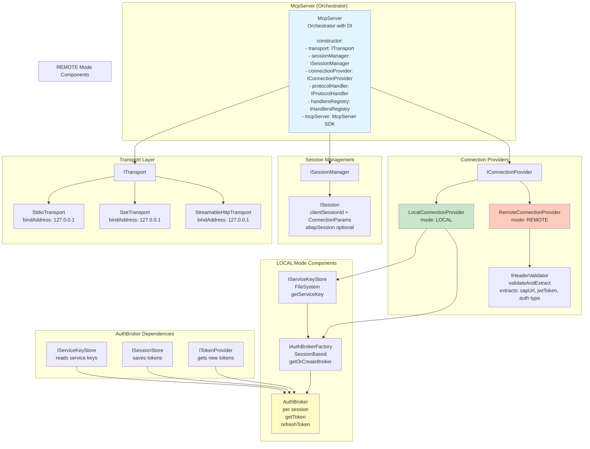
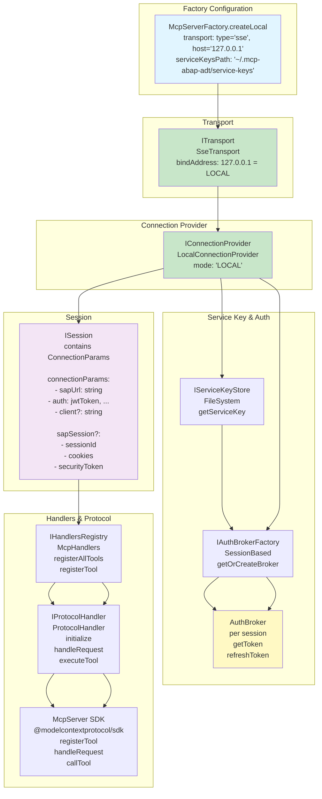
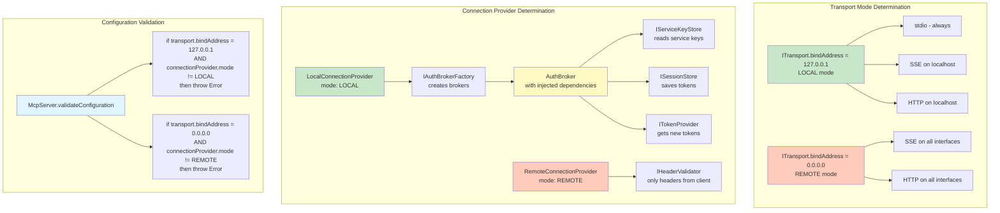
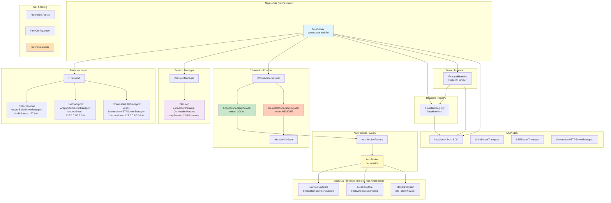
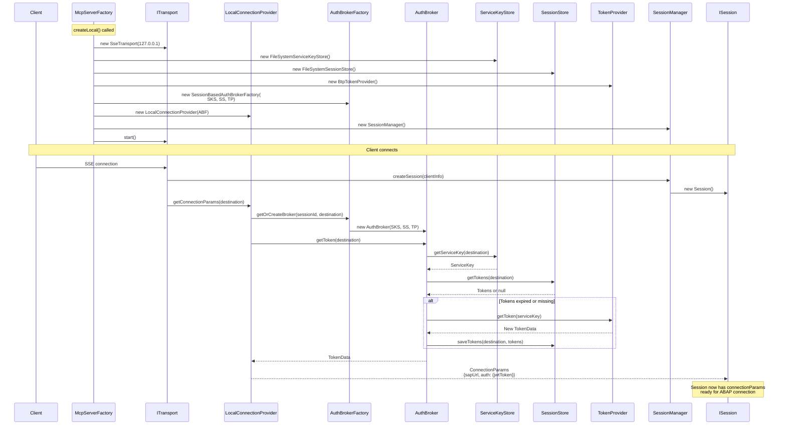
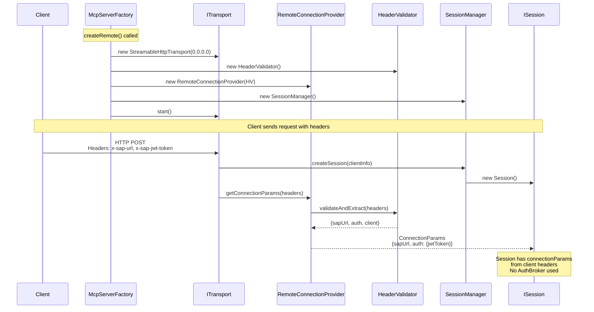
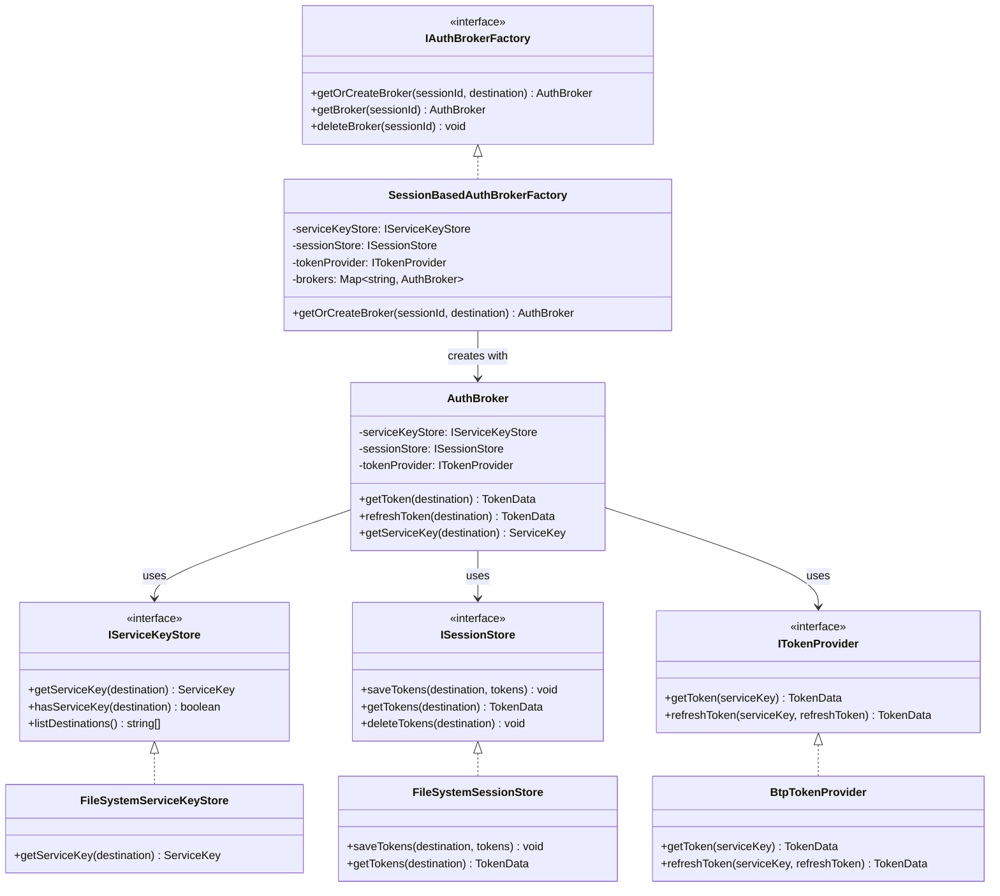
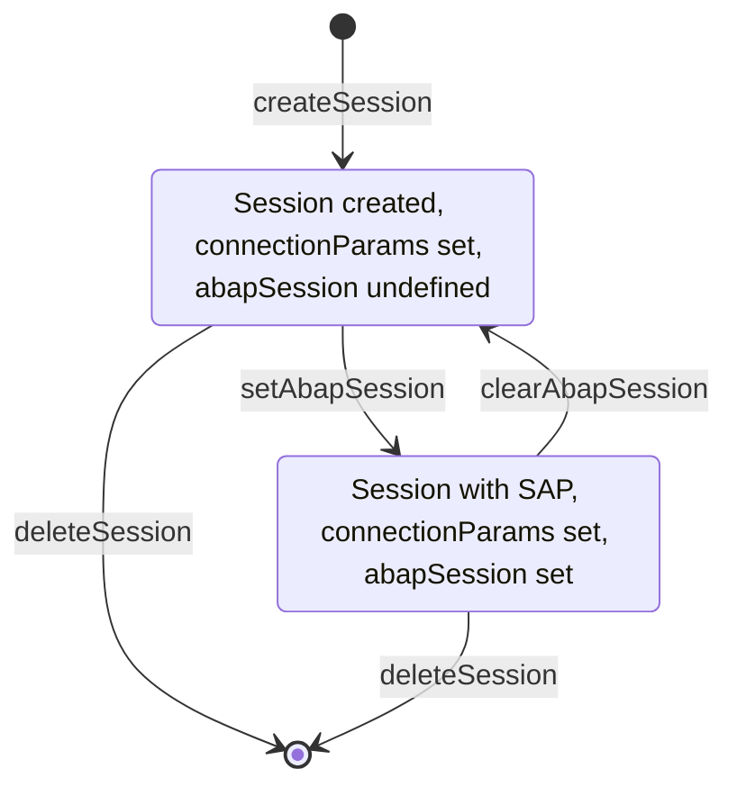
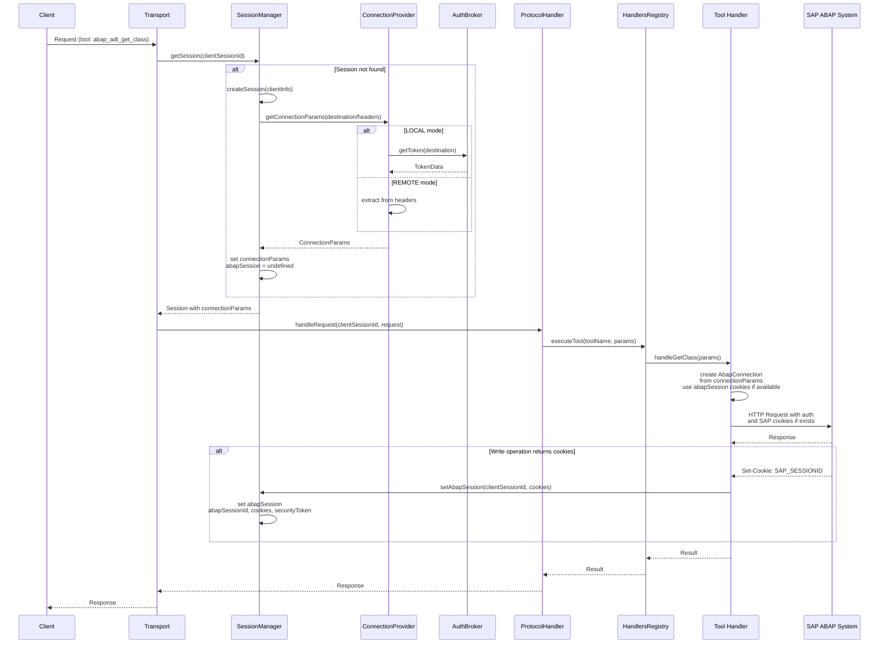
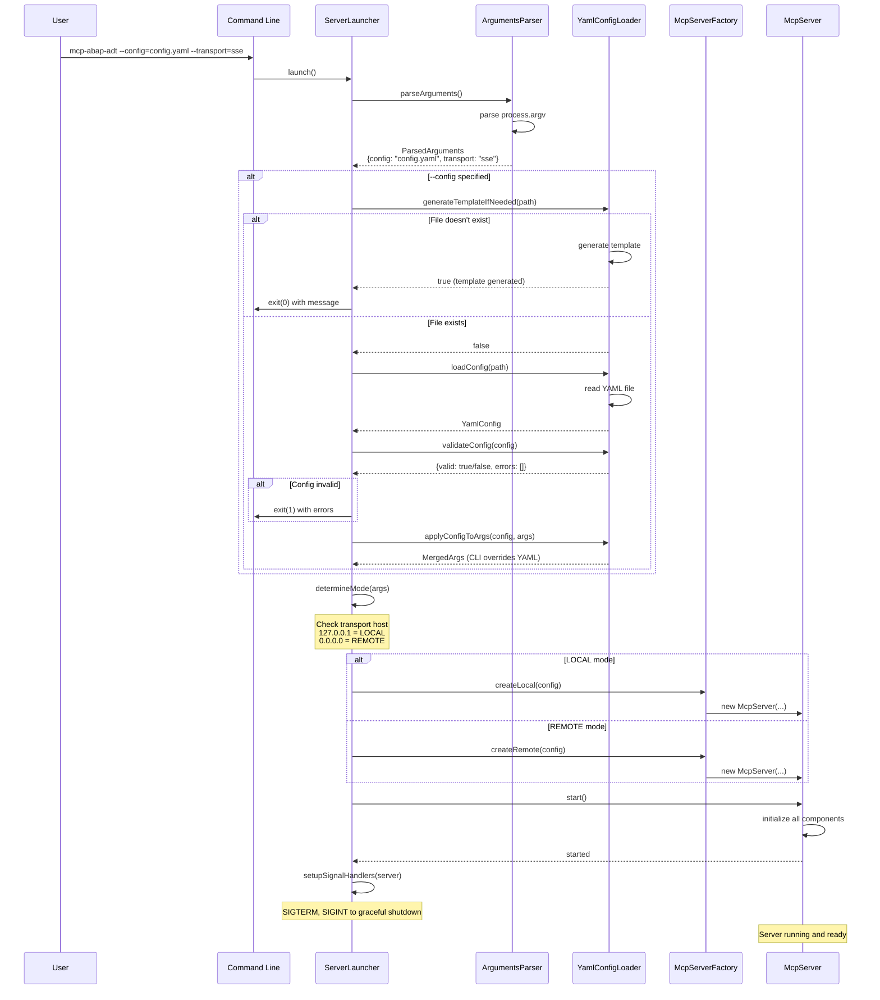

# MCP Server Architecture v2

## Terminology

### Session Types

**Unified Session** - single session type with two session IDs:
- **clientSessionId**: Identifies the client connection (UUID, managed by server)
- **abapSessionId**: Identifies the SAP ABAP connection (SAP_SESSIONID cookie, optional)

```typescript
interface ISession {
  // Client session ID - identifies the client connection
  clientSessionId: string;  // UUID, managed by server
  
  // Connection parameters to ABAP environment
  connectionParams: ConnectionParams;  // Required: sapUrl, auth, client
  
  // SAP session (optional) - only present when SAP cookies are available
  abapSession?: {
    abapSessionId: string;   // SAP_SESSIONID cookie value
    cookies: string[];        // All SAP cookies for stateful operations
    securityToken?: string;   // X-CSRF-Token
  };
  
  // Metadata
  createdAt: Date;
  lastActivity: Date;
  metadata: {
    transport: string;
    clientIP?: string;
    requestCount: number;
    errorCount: number;
  };
}
```

**Lifecycle**: 
- Session created with `clientSessionId` and `connectionParams`
- When first write operation occurs, SAP returns cookies → `abapSession` is set
- `abapSession` remains until session cleanup or SAP session expires

### Server Modes (determined through Dependency Injection)

**LOCAL mode** - server on localhost/stdio:
- Uses `IConnectionProvider` with `ServiceKeyStore` and `AuthBroker`
- Reads service keys from file system via `@mcp-abap-adt/auth-stores`
- Client does NOT know credentials
- Transports: stdio, SSE (127.0.0.1), HTTP (127.0.0.1)
- **Determined by**: `LocalConnectionProvider` + `ServiceKeyStoreConnectionProvider`

**REMOTE mode** - server on public IP:
- Uses `IConnectionProvider` with `ClientHeaderProvider`
- **WITHOUT** `AuthBroker` (proxy only)
- All parameters from client headers via `@mcp-abap-adt/header-validator`
- Server does NOT have credentials
- Transports: SSE (0.0.0.0), HTTP (0.0.0.0)
- **Determined by**: `RemoteConnectionProvider` + `HeaderBasedConnectionProvider`

---

## Component Diagram with Dependency Injection

### General Structure



### LOCAL Mode (with ServiceKeyStore and AuthBroker)



### REMOTE Mode (only headers from client)

```mermaid
graph TB
    subgraph "Factory Configuration"
        FC[McpServerFactory.createRemote<br/>transport: type='http', host='0.0.0.0']
    end
    
    subgraph "Transport"
        T[ITransport<br/>StreamableHttpTransport<br/>bindAddress: 0.0.0.0 = REMOTE]
    end
    
    subgraph "Connection Provider"
        CP[IConnectionProvider<br/>RemoteConnectionProvider<br/>mode: REMOTE]
    end
    
    subgraph "Header Validation"
        HV[IHeaderValidator<br/>@mcp-abap-adt/header-validator<br/>validateAndExtract headers<br/>extracts: sapUrl, jwtToken, auth type]
    end
    
    subgraph "NOT Used in REMOTE Mode"
        SK[IServiceKeyStore<br/>❌ NOT used]
        ABF[IAuthBrokerFactory<br/>❌ NOT used]
        AB[AuthBroker<br/>❌ NOT used]
    end
    
    FC --> T
    T --> CP
    CP --> HV
    
    style FC fill:#e1f5ff
    style T fill:#ffccbc
    style CP fill:#ffccbc
    style HV fill:#ffccbc
    style SK fill:#ffebee,stroke:#f44336,stroke-dasharray: 5 5
    style ABF fill:#ffebee,stroke:#f44336,stroke-dasharray: 5 5
    style AB fill:#ffebee,stroke:#f44336,stroke-dasharray: 5 5
```

### Behavior Determination through DI



---

## Mermaid Diagrams

### General Component Structure



### LOCAL Mode: Session Creation Sequence Diagram



### REMOTE Mode: Sequence Diagram



### AuthBroker Dependency Injection: Class Diagram



### Session Lifecycle: State Diagram



### Complete Flow: Request Processing



### Server Launcher: Startup Sequence Diagram



---

## Modules and Interfaces for Dependency Injection

### 1. Transport Layer (determines local/global)

**Responsibility**: Determines whether the server will be local (127.0.0.1) or global (0.0.0.0)

**Transport implementations extend SDK Transport classes directly**:

Our transports extend SDK transport classes from `@modelcontextprotocol/sdk` and add additional methods for our architecture.

**Base interface from SDK**:
```typescript
// From @modelcontextprotocol/sdk/shared/transport
import { Transport } from '@modelcontextprotocol/sdk/shared/transport.js';

interface Transport {
  start(): Promise<void>;
  send(message: JSONRPCMessage, options?: TransportSendOptions): Promise<void>;
  close(): Promise<void>;
  onclose?: () => void;
  onerror?: (error: Error) => void;
  onmessage?: <T extends JSONRPCMessage>(message: T, extra?: MessageExtraInfo) => void;
  sessionId?: string;
  setProtocolVersion?: (version: string) => void;
}
```

interface ClientInfo {
  transport: 'stdio' | 'sse' | 'http';
  ip?: string;
  headers?: Record<string, string>;
  userAgent?: string;
}
```

**Implementations**:

1. **StdioTransport extends StdioServerTransport**
   - Extends: `StdioServerTransport` from `@modelcontextprotocol/sdk/server/stdio`
   - Mode: always `LOCAL` (bindAddress = '127.0.0.1')
   - Single global session
   - Reads from stdin, writes to stdout
   - Additional methods: `connectSdkServer()`, `on()` for custom events
```typescript
   import { StdioServerTransport } from '@modelcontextprotocol/sdk/server/stdio.js';
   import { Transport } from '@modelcontextprotocol/sdk/shared/transport.js';
   
   class StdioTransport extends StdioServerTransport implements Transport {
     readonly type = 'stdio' as const;
     readonly bindAddress = '127.0.0.1';  // Always local
     readonly port?: number = undefined;
     
     constructor() {
       super();  // Call SDK transport constructor
     }
     
     // Additional method for our architecture
     async connectSdkServer(sdkServer: any, initializeSession: SessionInitializationCallback, defaultDestination?: string): Promise<void> {
       await sdkServer.server.connect(this);  // Connect to self (we are the SDK transport)
       // ... session initialization
     }
   }
   ```

2. **SseTransport extends SSEServerTransport**
   - Extends: `SSEServerTransport` from `@modelcontextprotocol/sdk/server/sse`
   - Mode: depends on bind address
   - SSE connections (Server-Sent Events)
   - Reconnect support
   - Additional methods: `connectSdkServer()`, `on()` for custom events, `handleRequest()`

3. **StreamableHttpTransport extends StreamableHTTPServerTransport**
   - Extends: `StreamableHTTPServerTransport` from `@modelcontextprotocol/sdk/server/streamableHttp`
   - Mode: depends on bind address
   - HTTP POST requests
   - Streaming responses
   - Additional methods: `connectSdkServer()`, `on()` for custom events, `handleRequest()`

**Mode determination**:
- `bindAddress === '127.0.0.1' || bindAddress === 'localhost'` → LOCAL mode
- `bindAddress === '0.0.0.0'` → REMOTE mode

### 2. Connection Provider (determines connection parameters source)

**Responsibility**: Determines whether to use service keys + AuthBroker or only headers from client

```typescript
interface IConnectionProvider {
  readonly mode: 'LOCAL' | 'REMOTE';
  
  /**
   * Gets connection parameters for session
   * @param request - request with session information and destination/headers
   * @returns connection parameters to SAP system
   */
  getConnectionParams(request: ConnectionRequest): Promise<ConnectionParams>;
  
  /**
   * Updates connection parameters (e.g., after token refresh)
   */
  updateConnectionParams(sessionId: string, params: Partial<ConnectionParams>): Promise<void>;
}

interface ConnectionRequest {
    sessionId: string;
  destination?: string;  // Only for LOCAL mode
  headers?: Record<string, string>;  // Only for REMOTE mode
}

interface ConnectionParams {
    sapUrl: string;
  auth: {
    type: 'jwt' | 'basic';
    jwtToken?: string;
    refreshToken?: string;
    username?: string;
    password?: string;
  };
  client?: string;
}
```

**Implementations**:

#### 2.1 LocalConnectionProvider (with ServiceKeyStore and AuthBroker)

**Important**: ServiceKeyStore, SessionStore, and TokenProvider are injected into AuthBroker through Factory

```typescript
class LocalConnectionProvider implements IConnectionProvider {
  readonly mode = 'LOCAL';
  
  constructor(
    private authBrokerFactory: IAuthBrokerFactory  // Factory creates AuthBroker with injected dependencies
  ) {}
  
  async getConnectionParams(request: ConnectionRequest): Promise<ConnectionParams> {
    if (!request.destination) {
      throw new Error('Destination required for LOCAL mode');
    }
    
    // 1. Create or get AuthBroker for session
    // AuthBroker already has injected ServiceKeyStore, SessionStore, TokenProvider
    const authBroker = await this.authBrokerFactory.getOrCreateBroker(
      request.sessionId,
      request.destination
    );
    
    // 2. Get/update token through AuthBroker
    // AuthBroker internally uses:
    //   - ServiceKeyStore to read service key
    //   - SessionStore to save/read tokens
    //   - TokenProvider to get new tokens
    const token = await authBroker.getToken(request.destination);
    
    // 3. Get service key for URL
    const serviceKey = await authBroker.getServiceKey(request.destination);
    
    return {
      sapUrl: serviceKey.url,
      auth: {
        type: 'jwt',
        jwtToken: token.accessToken,
        refreshToken: token.refreshToken
      },
      client: serviceKey.client
    };
  }
}
```

**How AuthBroker works with injected dependencies**:
```typescript
// AuthBroker (from @mcp-abap-adt/auth-broker)
class AuthBroker {
  constructor(
    private serviceKeyStore: IServiceKeyStore,  // Injected
    private sessionStore: ISessionStore,         // Injected
    private tokenProvider: ITokenProvider         // Injected
  ) {}
  
  async getToken(destination: string): Promise<TokenData> {
    // 1. Read service key through ServiceKeyStore
    const serviceKey = await this.serviceKeyStore.getServiceKey(destination);
    
    // 2. Check if saved tokens exist through SessionStore
    let tokens = await this.sessionStore.getTokens(destination);
    
    // 3. If tokens missing or expired, get new ones through TokenProvider
    if (!tokens || this.isExpired(tokens)) {
      tokens = await this.tokenProvider.getToken(serviceKey);
      await this.sessionStore.saveTokens(destination, tokens);
    }
    
    return tokens;
  }
}
```

#### 2.2 RemoteConnectionProvider (only headers from client)
```typescript
class RemoteConnectionProvider implements IConnectionProvider {
  readonly mode = 'REMOTE';
  
  constructor(
    private headerValidator: IHeaderValidator  // @mcp-abap-adt/header-validator
  ) {}
  
  async getConnectionParams(request: ConnectionRequest): Promise<ConnectionParams> {
    if (!request.headers) {
      throw new Error('Headers required for REMOTE mode');
    }
    
    // Validate and extract parameters from headers
    const validated = await this.headerValidator.validateAndExtract(request.headers);
    
    return {
      sapUrl: validated.sapUrl,
      auth: validated.auth,
      client: validated.client
    };
  }
}
```


### 4. Auth Broker Factory

**Responsibility**: Creation and management of AuthBroker instances

```typescript
interface IAuthBrokerFactory {
  /**
   * Creates or returns existing AuthBroker for session
   * ServiceKeyStore, SessionStore, and TokenProvider are injected into AuthBroker
   */
  getOrCreateBroker(
    sessionId: string,
    destination: string
  ): Promise<AuthBroker>;  // @mcp-abap-adt/auth-broker
  
  /**
   * Gets existing AuthBroker
   */
  getBroker(sessionId: string): AuthBroker | undefined;
  
  /**
   * Deletes AuthBroker for session
   */
  deleteBroker(sessionId: string): void;
  
  /**
   * Clears all brokers (on shutdown)
   */
  clearAll(): void;
}
```

**Implementations**:
- `SessionBasedAuthBrokerFactory`: one broker per session (recommended)
  - Injects `IServiceKeyStore`, `ISessionStore`, `ITokenProvider` into AuthBroker
  - AuthBroker uses these dependencies for token management

### 4.1 Service Key Store Interface

**Responsibility**: Abstraction for reading service keys from various sources

```typescript
interface IServiceKeyStore {
  /**
   * Gets service key for destination
   */
  getServiceKey(destination: string): Promise<ServiceKey>;
  
  /**
   * Checks if service key exists for destination
   */
  hasServiceKey(destination: string): Promise<boolean>;
  
  /**
   * List of available destinations
   */
  listDestinations(): Promise<string[]>;
}

interface ServiceKey {
  destination: string;
  url: string;
  uaaUrl?: string;
  clientId?: string;
  clientSecret?: string;
  // ... other fields from service key JSON
}
```

**Implementations**:
- `FileSystemServiceKeyStore`: reads from `~/.mcp-abap-adt/service-keys/{destination}.json`
- `MemoryServiceKeyStore`: for testing
- `EnvironmentServiceKeyStore`: reads from environment variables

### 4.2 Session Store Interface

**Responsibility**: Abstraction for storing tokens and sessions

```typescript
interface ISessionStore {
  /**
   * Saves tokens for destination
   */
  saveTokens(destination: string, tokens: TokenData): Promise<void>;
  
  /**
   * Gets tokens for destination
   */
  getTokens(destination: string): Promise<TokenData | null>;
  
  /**
   * Deletes tokens for destination
   */
  deleteTokens(destination: string): Promise<void>;
}

interface TokenData {
  accessToken: string;
  refreshToken?: string;
  expiresAt?: Date;
}
```

**Implementations**:
- `FileSystemSessionStore`: saves to `~/.mcp-abap-adt/sessions/{destination}.env`
- `MemorySessionStore`: for testing

### 4.3 Token Provider Interface

**Responsibility**: Obtaining tokens from BTP or other sources

```typescript
interface ITokenProvider {
  /**
   * Gets token from service key
   */
  getToken(serviceKey: ServiceKey): Promise<TokenData>;
  
  /**
   * Refreshes token using refresh token
   */
  refreshToken(serviceKey: ServiceKey, refreshToken: string): Promise<TokenData>;
}
```

**Implementations**:
- `BtpTokenProvider`: gets tokens from SAP BTP via OAuth2
- `MockTokenProvider`: for testing

### 5. Session Manager

**Responsibility**: Managing sessions that contain connection parameters to ABAP environment

```typescript
interface ISessionManager {
  /**
   * Creates a new session with clientSessionId
   * @param clientInfo - information about the client connection
   * @returns new session with clientSessionId (UUID) and connectionParams
   */
  createSession(clientInfo: ClientInfo): ISession;
  
  /**
   * Gets session by clientSessionId
   */
  getSession(clientSessionId: string): ISession | undefined;
  
  /**
   * Deletes session by clientSessionId
   */
  deleteSession(clientSessionId: string): void;
  
  /**
   * Sets SAP ABAP session cookies when received from SAP
   * @param clientSessionId - client session ID
   * @param sapCookies - cookies from SAP response (Set-Cookie headers)
   */
  setAbapSession(clientSessionId: string, sapCookies: string[]): void;
  
  /**
   * Clears SAP ABAP session (e.g., on expiry or cleanup)
   */
  clearAbapSession(clientSessionId: string): void;
  
  // Events
  on(event: 'created', handler: (session: ISession) => void): void;
  on(event: 'closed', handler: (session: ISession) => void): void;
  on(event: 'abapSessionSet', handler: (session: ISession) => void): void;
}

interface ISession {
  /**
   * Client session ID - identifies the client connection
   * UUID, managed by server
   */
  readonly clientSessionId: string;
  
  readonly createdAt: Date;
  lastActivity: Date;
  
  /**
   * Connection parameters to ABAP environment
   * This is the main session information - how to connect to SAP system
   */
  connectionParams: ConnectionParams;  // Required field
  
  /**
   * SAP ABAP session (optional) - only present when SAP cookies are available
   * Used for stateful operations (lock, unlock, etc.)
   */
  abapSession?: {
    abapSessionId: string;   // SAP_SESSIONID cookie value
    cookies: string[];        // All SAP cookies for stateful operations
    securityToken?: string;   // X-CSRF-Token
  };
  
  // Metadata
  metadata: {
    transport: 'stdio' | 'sse' | 'http';
    clientIP?: string;
    requestCount: number;
    errorCount: number;
  };
}

/**
 * Connection parameters to ABAP environment
 * Stored in session and used for creating AbapConnection
 */
interface ConnectionParams {
  sapUrl: string;           // ABAP system URL
  auth: {
    type: 'jwt' | 'basic';
    jwtToken?: string;       // JWT token for authentication
    refreshToken?: string;   // Refresh token for renewal
    username?: string;       // Basic auth
    password?: string;       // Basic auth
  };
  client?: string;          // SAP client number
}
```

### 6. Handlers Registry

**Responsibility**: Registration and management of MCP tool handlers

Handlers are organized into groups and registered through Dependency Injection, allowing flexible composition of handler sets based on requirements.

```typescript
interface IHandlersRegistry {
  /**
   * Registers all tools on MCP server
   * @param server - McpServer instance for tool registration
   */
  registerAllTools(server: McpServer): void;
  
  /**
   * Registers a single tool on server
   * @param server - McpServer instance
   * @param toolName - tool name
   * @param toolDefinition - tool definition (name, description, inputSchema)
   * @param handler - handler function
   */
  registerTool(
    server: McpServer,
    toolName: string,
    toolDefinition: ToolDefinition,
    handler: ToolHandler
  ): void;
  
  /**
   * Gets list of registered tools
   */
  getRegisteredTools(): string[];
}

interface ToolDefinition {
  name: string;
  description: string;
  inputSchema: any;  // JSON Schema or Zod schema object
}

type ToolHandler = (args: any) => Promise<any>;

/**
 * Interface for a group of handlers
 * Allows splitting handlers into logical groups (readonly, high-level, low-level, system, etc.)
 */
interface IHandlerGroup {
  /**
   * Gets the name of the handler group (for identification and debugging)
   */
  getName(): string;

  /**
   * Gets all handler entries in this group
   * @returns Array of handler entries (tool definition + handler function)
   */
  getHandlers(): HandlerEntry[];

  /**
   * Registers all handlers from this group on the MCP server
   * @param server - McpServer instance for tool registration
   */
  registerHandlers(server: McpServer): void;
}

interface HandlerEntry {
  toolDefinition: ToolDefinition;
  handler: ToolHandler;
}
```

**Implementations**:

1. **`CompositeHandlersRegistry`** (recommended) - implements `IHandlersRegistry`
   - Accepts array of `IHandlerGroup` instances via constructor (Dependency Injection)
   - Allows flexible composition of handler sets
   - Supports dynamic addition/removal of handler groups
   - Example:
     ```typescript
     const registry = new CompositeHandlersRegistry([
       new ReadOnlyHandlersGroup(),
       new HighLevelHandlersGroup(),
       new LowLevelHandlersGroup(),
     ]);
     ```

2. **`McpHandlers`** (legacy, from `mcp_handlers.ts`) - implements `IHandlersRegistry`
   - Method `RegisterAllToolsOnServer()` → `registerAllTools()`
   - Imports all handlers and their `TOOL_DEFINITION`
   - Converts JSON Schema to Zod schema for SDK
   - **Note**: Consider migrating to `CompositeHandlersRegistry` with handler groups

**Handler Groups**:

- **`ReadOnlyHandlersGroup`** - All read-only handlers (get operations)
- Additional groups can be created:
  - `HighLevelHandlersGroup` - High-level CRUD operations
  - `LowLevelHandlersGroup` - Low-level operations (lock, unlock, activate, etc.)
  - `SystemHandlersGroup` - System-level operations
  - `SearchHandlersGroup` - Search and discovery operations

**Base Class for Handler Groups**:

- **`BaseHandlerGroup`** - Abstract base class for creating handler groups
  - Provides `jsonSchemaToZod()` conversion utility
  - Provides `registerToolOnServer()` helper with error handling
  - Handles response format conversion (JSON to MCP text format)
  - Subclasses must implement `getHandlers()` method

**Creating Custom Handler Groups**:

```typescript
import { BaseHandlerGroup } from "./handlers/base/BaseHandlerGroup.js";
import { HandlerEntry } from "./handlers/interfaces.js";

export class CustomHandlersGroup extends BaseHandlerGroup {
  protected groupName = "CustomHandlers";

  getHandlers(): HandlerEntry[] {
    return [
      {
        toolDefinition: {
          name: "MyCustomTool",
          description: "Description of my custom tool",
          inputSchema: {
            type: "object",
            properties: { param1: { type: "string" } },
            required: ["param1"],
          },
        },
        handler: async (args: any) => {
          // Handler implementation
          return { content: [{ type: "text", text: "Result" }] };
        },
      },
    ];
  }
}
```

**Usage Example**:

```typescript
// For a read-only server (e.g., public API)
const readonlyRegistry = new CompositeHandlersRegistry([
  new ReadOnlyHandlersGroup(),
]);

// For a full-featured server
const fullRegistry = new CompositeHandlersRegistry([
  new ReadOnlyHandlersGroup(),
  new HighLevelHandlersGroup(),
  new LowLevelHandlersGroup(),
]);

// Register all tools
fullRegistry.registerAllTools(mcpServer);
```

**Integration with McpServer**:

The `IHandlersRegistry` is injected into `McpServer` via constructor:

```typescript
class McpServer {
  constructor(
    private transport: ITransport,
    private sessionManager: ISessionManager,
    private connectionProvider: IConnectionProvider,
    private protocolHandler: IProtocolHandler,
    private handlersRegistry: IHandlersRegistry,  // Injected
    private mcpServer: McpServer,  // SDK instance
    private logger?: ILogger
  ) {
    // Initialize protocol handler with registry
    this.protocolHandler.initialize(this.handlersRegistry, this.mcpServer);
  }
}
```

**Integration with McpServerFactory**:

```typescript
// In McpServerFactory.createLocal() or createRemote()
const handlersRegistry = new CompositeHandlersRegistry([
  new ReadOnlyHandlersGroup(),
  new HighLevelHandlersGroup(),
  new LowLevelHandlersGroup(),
]);

const server = new McpServer(
  transport,
  sessionManager,
  connectionProvider,
  protocolHandler,
  handlersRegistry,  // Injected
  mcpServer,
  logger
);
```

### 7. Protocol Handler

```typescript
interface IProtocolHandler {
  /**
   * Handles MCP request
   */
  handleRequest(sessionId: string, request: McpRequest): Promise<McpResponse>;
  
  /**
   * Executes tool by name
   */
  executeTool(sessionId: string, toolName: string, params: any): Promise<any>;
  
  /**
   * Initializes handler with registry
   */
  initialize(handlersRegistry: IHandlersRegistry, server: McpServer): void;
}
```

**Implementation**:
- `ProtocolHandler` uses `IHandlersRegistry` for tool registration
- On initialization calls `handlersRegistry.registerAllTools(server)`
- On tool execution uses registered handlers from `McpServer`

### 8. CLI Arguments Parser

**Responsibility**: Processing startup parameters from command line

```typescript
interface IArgumentsParser {
  /**
   * Parses command line arguments
   */
  parseArguments(): ParsedArguments;
  
  /**
   * Gets argument value
   */
  getArgument(name: string): string | undefined;
  
  /**
   * Checks if flag exists
   */
  hasFlag(name: string): boolean;
}

interface ParsedArguments {
  transport?: 'stdio' | 'sse' | 'http' | 'streamable-http';
  config?: string;  // Path to YAML config file
  mcp?: string;     // Default destination
  env?: string;     // Path to .env file
  'auth-broker'?: boolean;
  'auth-broker-path'?: string;
  unsafe?: boolean;
  http?: {
    port?: number;
    host?: string;
    'json-response'?: boolean;
    'allowed-origins'?: string[];
    'allowed-hosts'?: string[];
    'enable-dns-protection'?: boolean;
  };
  sse?: {
    port?: number;
    host?: string;
    'allowed-origins'?: string[];
    'allowed-hosts'?: string[];
    'enable-dns-protection'?: boolean;
  };
}
```

**Implementation**:
- `ArgumentsParser` - parses `process.argv`
- Support for `--key=value` and `--key value` formats
- Support for boolean flags (`--flag`)

### 9. YAML Config Loader

**Responsibility**: Reading and validating YAML configuration

```typescript
interface IYamlConfigLoader {
  /**
   * Loads YAML configuration from file
   */
  loadConfig(path: string): Promise<YamlConfig>;
  
  /**
   * Validates YAML configuration
   */
  validateConfig(config: YamlConfig): { valid: boolean; errors: string[] };
  
  /**
   * Generates configuration template if file doesn't exist
   */
  generateTemplateIfNeeded(path: string): Promise<boolean>;
  
  /**
   * Applies YAML configuration to arguments
   * (YAML values can be overridden by CLI arguments)
   */
  applyConfigToArgs(config: YamlConfig, args: ParsedArguments): ParsedArguments;
}

interface YamlConfig {
  transport?: string;
  mcp?: string;
  env?: string;
  unsafe?: boolean;
  'auth-broker'?: boolean;
  'auth-broker-path'?: string;
  http?: {
    port?: number;
    host?: string;
    'json-response'?: boolean;
    'allowed-origins'?: string[];
    'allowed-hosts'?: string[];
    'enable-dns-protection'?: boolean;
  };
  sse?: {
    port?: number;
    host?: string;
    'allowed-origins'?: string[];
    'allowed-hosts'?: string[];
    'enable-dns-protection'?: boolean;
  };
}
```

**Implementation**:
- `YamlConfigLoader` - reads YAML file, validates structure
- If file doesn't exist and `--config` is specified, generates template
- CLI arguments have priority over YAML values

### 10. Server Launcher

**Responsibility**: Combines argument parsing, YAML loading, server creation and startup

```typescript
interface IServerLauncher {
  /**
   * Launches server with parameters from CLI and/or YAML
   */
  launch(): Promise<void>;
}

class ServerLauncher implements IServerLauncher {
  constructor(
    private argumentsParser: IArgumentsParser,
    private yamlConfigLoader: IYamlConfigLoader,
    private serverFactory: typeof McpServerFactory
  ) {}
  
  async launch(): Promise<void> {
    // 1. Parse CLI arguments
    const args = this.argumentsParser.parseArguments();
    
    // 2. If --config specified, load YAML
    let config: YamlConfig | undefined;
    if (args.config) {
      // Generate template if file doesn't exist
      const templateGenerated = await this.yamlConfigLoader.generateTemplateIfNeeded(args.config);
      if (templateGenerated) {
        console.log(`Config template generated at ${args.config}. Please edit it and run again.`);
        process.exit(0);
      }
      
      // Load configuration
      config = await this.yamlConfigLoader.loadConfig(args.config);
      
      // Validate
      const validation = this.yamlConfigLoader.validateConfig(config);
      if (!validation.valid) {
        console.error('Config validation errors:');
        validation.errors.forEach(err => console.error(`  - ${err}`));
        process.exit(1);
      }
      
      // Apply YAML to arguments (CLI has priority)
      const mergedArgs = this.yamlConfigLoader.applyConfigToArgs(config, args);
      Object.assign(args, mergedArgs);
    }
    
    // 3. Determine mode (LOCAL/REMOTE) based on transport host
    const mode = this.determineMode(args);
    
    // 4. Create server through Factory
    const server = mode === 'LOCAL'
      ? this.serverFactory.createLocal(this.buildLocalConfig(args))
      : this.serverFactory.createRemote(this.buildRemoteConfig(args));
    
    // 5. Start server
    await server.start();
    
    // 6. Signal handling for graceful shutdown
    this.setupSignalHandlers(server);
  }
  
  private determineMode(args: ParsedArguments): 'LOCAL' | 'REMOTE' {
    const transport = args.transport || 'stdio';
    const host = transport === 'http' || transport === 'streamable-http'
      ? args.http?.host
      : transport === 'sse'
      ? args.sse?.host
      : '127.0.0.1';
    
    return (host === '127.0.0.1' || host === 'localhost' || transport === 'stdio')
      ? 'LOCAL'
      : 'REMOTE';
  }
  
  private buildLocalConfig(args: ParsedArguments): LocalServerConfig {
    return {
      transport: this.buildTransportConfig(args),
      serviceKeysPath: args['auth-broker-path'],
      sessionsPath: args['auth-broker-path'],
      unsafe: args.unsafe || false,
      defaultDestination: args.mcp
    };
  }
  
  private buildRemoteConfig(args: ParsedArguments): RemoteServerConfig {
    return {
      transport: this.buildTransportConfig(args),
      authMethodPriority: AuthMethodPriority.DEFAULT
    };
  }
  
  private buildTransportConfig(args: ParsedArguments): TransportConfig {
    const transport = args.transport || 'stdio';
    
    if (transport === 'stdio') {
      return { type: 'stdio' };
    }
    
    if (transport === 'sse') {
      return {
        type: 'sse',
        port: args.sse?.port || 3001,
        allowedOrigins: args.sse?.['allowed-origins']
      };
    }
    
    // http or streamable-http
    return {
      type: 'http',
      port: args.http?.port || 3000,
      allowedOrigins: args.http?.['allowed-origins']
    };
  }
  
  private setupSignalHandlers(server: McpServer): void {
    const shutdown = async () => {
      await server.stop();
      process.exit(0);
    };
    
    process.on('SIGTERM', shutdown);
    process.on('SIGINT', shutdown);
  }
}
```

**Usage**:
```typescript
// Entry point (bin/mcp-abap-adt.js)
import { ServerLauncher } from './lib/servers/v2/launcher';
import { ArgumentsParser } from './lib/servers/v2/cli';
import { YamlConfigLoader } from './lib/servers/v2/yaml';
import { McpServerFactory } from './lib/servers/v2/core/factory';

const launcher = new ServerLauncher(
  new ArgumentsParser(),
  new YamlConfigLoader(),
  McpServerFactory
);

launcher.launch().catch(error => {
  console.error('Failed to start server:', error);
  process.exit(1);
});
```

---

## Dependency Injection - How Injected Dependencies Determine Behavior

### Main Idea

**Server behavior is determined through injected dependencies**:
1. **ITransport** determines whether it will be local SSE or global HTTP
2. **IConnectionProvider** determines whether to use service keys + AuthBroker or only headers

### McpServer Class with Dependency Injection

```typescript
class McpServer {
  constructor(
    private transport: ITransport,
    private sessionManager: ISessionManager,
    private connectionProvider: IConnectionProvider,  // Instead of authStrategy
    private protocolHandler: IProtocolHandler,
    private handlersRegistry: IHandlersRegistry,  // Handlers registry
    private mcpServer: McpServer,  // @modelcontextprotocol/sdk/server/mcp
    private logger?: ILogger  // @mcp-abap-adt/logger
  ) {
    // Validation: transport.bindAddress must match connectionProvider.mode
    this.validateConfiguration();
    
    // Initialize protocol handler with registry
    this.protocolHandler.initialize(this.handlersRegistry, this.mcpServer);
  }
  
  private validateConfiguration(): void {
    const transportMode = this.transport.bindAddress === '127.0.0.1' || 
                         this.transport.bindAddress === 'localhost' 
                         ? 'LOCAL' : 'REMOTE';
    
    if (transportMode !== this.connectionProvider.mode) {
      throw new Error(
        `Transport mode (${transportMode}) does not match ConnectionProvider mode (${this.connectionProvider.mode})`
      );
    }
  }
  
  async start(): Promise<void> {
    await this.transport.start();
    this.setupEventHandlers();
    this.logger?.info(`Server started in ${this.connectionProvider.mode} mode`);
  }
  
  private setupEventHandlers(): void {
    // On new session
    this.transport.on('session:created', async (sessionId, clientInfo) => {
      const session = this.sessionManager.createSession(clientInfo);
      
      // Get connection parameters through connectionProvider
      try {
        const connectionParams = await this.connectionProvider.getConnectionParams({
          sessionId,
          destination: clientInfo.headers?.[HEADER_MCP_DESTINATION],
          headers: clientInfo.headers
        });
        
        // Store in session
        session.connectionParams = connectionParams;
      } catch (error) {
        this.logger?.error(`Failed to get connection params for session ${sessionId}:`, error);
        this.sessionManager.deleteSession(sessionId);
      }
    });
    
    // On message
    this.transport.on('message', async (sessionId, message) => {
      const response = await this.protocolHandler.handleRequest(sessionId, message);
      await this.transport.send(sessionId, response);
    });
    
    // On session close
    this.transport.on('session:closed', (sessionId) => {
      this.sessionManager.deleteSession(sessionId);
    });
  }
  
  async stop(): Promise<void> {
    await this.transport.stop();
  }
}
```

### Factory for Server Creation

```typescript
class McpServerFactory {
  /**
   * Creates LOCAL server (with service keys and AuthBroker)
   */
  static createLocal(config: LocalServerConfig): McpServer {
    // 1. Create transport (local)
    const transport = this.createLocalTransport(config.transport);
    
    // 2. Create service key store
    const serviceKeyStore = new FileSystemServiceKeyStore({
      basePath: config.serviceKeysPath || getPlatformPaths().serviceKeysPath
    });
    
    // 3. Create session store
    const sessionStore = new FileSystemSessionStore({
      basePath: config.sessionsPath || getPlatformPaths().sessionsPath
    });
    
    // 4. Create token provider
    const tokenProvider = new BtpTokenProvider();
    
    // 5. Create auth broker factory
    // Factory injects ServiceKeyStore, SessionStore, TokenProvider into AuthBroker
    const authBrokerFactory = new SessionBasedAuthBrokerFactory({
      serviceKeyStore,    // Injected into AuthBroker
      sessionStore,       // Injected into AuthBroker
      tokenProvider,      // Injected into AuthBroker
      unsafe: config.unsafe || false
    });
    
    // 6. Create connection provider (LOCAL mode)
    // Only pass factory - all dependencies already injected into AuthBroker
    const connectionProvider = new LocalConnectionProvider(authBrokerFactory);
    
    // 6. Create session manager
    const sessionManager = new SessionManager();
    
    // 7. Create MCP server (from SDK)
    const mcpServer = new McpServer({
      name: 'mcp-abap-adt',
      version: '1.0.0'
    });
    
    // 8. Create handlers registry
    const handlersRegistry = new McpHandlers();
    
    // 9. Create protocol handler
    const protocolHandler = new ProtocolHandler();
    
    return new McpServer(
      transport,
      sessionManager,
      connectionProvider,
      protocolHandler,
      handlersRegistry,
      mcpServer,
      config.logger
    );
  }
  
  /**
   * Creates REMOTE server (only headers from client)
   */
  static createRemote(config: RemoteServerConfig): McpServer {
    // 1. Create transport (global)
    const transport = this.createRemoteTransport(config.transport);
    
    // 2. Create header validator
    const headerValidator = new HeaderValidator({
      authMethodPriority: config.authMethodPriority || AuthMethodPriority.DEFAULT
    });
    
    // 3. Create connection provider (REMOTE mode)
    const connectionProvider = new RemoteConnectionProvider(headerValidator);
    
    // 4. Create session manager
    const sessionManager = new SessionManager();
    
    // 5. Create MCP server (from SDK)
    const mcpServer = new McpServer({
      name: 'mcp-abap-adt',
      version: '1.0.0'
    });
    
    // 6. Create handlers registry
    const handlersRegistry = new McpHandlers();
    
    // 7. Create protocol handler
    const protocolHandler = new ProtocolHandler();
    
    return new McpServer(
      transport,
      sessionManager,
      connectionProvider,
      protocolHandler,
      handlersRegistry,
      mcpServer,
      config.logger
    );
  }
  
  private static createLocalTransport(config: TransportConfig): ITransport {
    switch (config.type) {
      case 'stdio':
        return new StdioTransport();
      case 'sse':
        return new SseTransport({
          host: '127.0.0.1',  // Always local
          port: config.port || 3001,
          allowedOrigins: config.allowedOrigins
        });
      case 'http':
        return new StreamableHttpTransport({
          host: '127.0.0.1',  // Always local
          port: config.port || 3000,
          allowedOrigins: config.allowedOrigins
        });
    }
  }
  
  private static createRemoteTransport(config: TransportConfig): ITransport {
    switch (config.type) {
      case 'sse':
        return new SseTransport({
          host: '0.0.0.0',  // Global
          port: config.port || 3001,
          allowedOrigins: config.allowedOrigins
        });
      case 'http':
        return new StreamableHttpTransport({
          host: '0.0.0.0',  // Global
          port: config.port || 3000,
          allowedOrigins: config.allowedOrigins
        });
      default:
        throw new Error('REMOTE mode requires SSE or HTTP transport');
    }
  }
}

interface LocalServerConfig {
  transport: TransportConfig;
  serviceKeysPath?: string;
  sessionsPath?: string;
  unsafe?: boolean;
  tokenProvider?: TokenProviderConfig;
  logger?: ILogger;
}

interface RemoteServerConfig {
  transport: TransportConfig;
  authMethodPriority?: AuthMethodPriority;
  logger?: ILogger;
}

interface TransportConfig {
  type: 'stdio' | 'sse' | 'http';
  port?: number;
  allowedOrigins?: string[];
}
```

### Usage Examples

#### LOCAL mode (stdio with service keys)
```typescript
const server = McpServerFactory.createLocal({
  transport: { type: 'stdio' },
  serviceKeysPath: '~/.mcp-abap-adt/service-keys'
});

await server.start();
// Uses ServiceKeyStore + AuthBroker
// Client passes destination in headers: x-mcp-destination: prod
```

#### LOCAL mode (SSE on localhost)
```typescript
const server = McpServerFactory.createLocal({
  transport: {
    type: 'sse',
    port: 3001,
    allowedOrigins: ['http://localhost:3000']
  },
  serviceKeysPath: '~/.mcp-abap-adt/service-keys'
});

await server.start();
// bindAddress = 127.0.0.1 (local)
// Uses ServiceKeyStore + AuthBroker
```

#### REMOTE mode (HTTP on all interfaces)
```typescript
const server = McpServerFactory.createRemote({
  transport: {
    type: 'http',
    port: 3000,
    allowedOrigins: ['https://example.com']
  }
});

await server.start();
// bindAddress = 0.0.0.0 (global)
// Does NOT use ServiceKeyStore + AuthBroker
// All parameters from client headers
```

### Behavior Determination through DI

| Component | LOCAL Mode | REMOTE Mode |
|-----------|------------|-------------|
| **ITransport.bindAddress** | `127.0.0.1` | `0.0.0.0` |
| **IConnectionProvider** | `LocalConnectionProvider` | `RemoteConnectionProvider` |
| **IAuthBrokerFactory** | `SessionBasedAuthBrokerFactory` | ❌ Not used |
| **IServiceKeyStore** | `FileSystemServiceKeyStore` (injected into AuthBroker) | ❌ Not used |
| **ISessionStore** | `FileSystemSessionStore` (injected into AuthBroker) | ❌ Not used |
| **ITokenProvider** | `BtpTokenProvider` (injected into AuthBroker) | ❌ Not used |
| **IHeaderValidator** | ❌ Not used | `HeaderValidator` |
| **Parameters source** | Service keys + AuthBroker (with injected stores) | Headers from client |
| **Client knows credentials** | ❌ No | ✅ Yes |
| **Session contains** | `ConnectionParams` (sapUrl, auth, client) | `ConnectionParams` (from headers) |

---

## Usage Scenarios

### LOCAL mode (Cline IDE with stdio)

**Configuration**:
```typescript
const server = McpServerFactory.createLocal({
  transport: { type: 'stdio' },
  serviceKeysPath: '~/.mcp-abap-adt/service-keys'
});
```

**Flow**:
```
Client (Cline) → stdio → McpServer
                          ↓
                  ITransport (StdioTransport, bindAddress=127.0.0.1)
                          ↓
                  IConnectionProvider (LocalConnectionProvider)
                          ↓
                  IServiceKeyStore.getServiceKey('prod')
                          ↓
                  IAuthBrokerFactory.getOrCreateBroker(sessionId)
                          ↓
                  AuthBroker.getToken('prod')
                          ↓
                  creates session with clientSessionId and connectionParams
```

**Characteristics**:
- Transport: `StdioTransport` (always local)
- ConnectionProvider: `LocalConnectionProvider` (uses service keys)
- Client passes: `x-mcp-destination: prod` in MCP request
- Server reads: `~/.mcp-abap-adt/service-keys/prod.json`
- Server gets token: via `AuthBroker` with caching

### LOCAL mode (SSE on localhost)

**Configuration**:
```typescript
const server = McpServerFactory.createLocal({
  transport: {
    type: 'sse',
    port: 3001,
    allowedOrigins: ['http://localhost:3000']
  }
});
```

**Flow**:
```
Client → SSE (http://127.0.0.1:3001) → McpServer
                                          ↓
                                  ITransport (SseTransport, bindAddress=127.0.0.1)
                                          ↓
                                  IConnectionProvider (LocalConnectionProvider)
                                          ↓
                                  [same as stdio flow]
```

**Characteristics**:
- Transport: `SseTransport` with `bindAddress=127.0.0.1` (local)
- ConnectionProvider: `LocalConnectionProvider` (uses service keys)
- Client passes: `x-mcp-destination: prod` in SSE connection headers

### REMOTE mode (HTTP on all interfaces)

**Configuration**:
```typescript
const server = McpServerFactory.createRemote({
  transport: {
    type: 'http',
    port: 3000,
    allowedOrigins: ['https://example.com']
  }
});
```

**Flow**:
```
Client → HTTP POST (http://10.0.0.100:3000/mcp)
         Headers:
           x-sap-url: https://my-abap.com
           x-sap-jwt-token: eyJ...
           x-session-id: abc-123
            ↓
        McpServer (REMOTE)
            ↓
        ITransport (StreamableHttpTransport, bindAddress=0.0.0.0)
                    ↓
        IConnectionProvider (RemoteConnectionProvider)
                    ↓
        IHeaderValidator.validateAndExtract(headers)
                    ↓
        extracts connectionParams from headers
                    ↓
        creates session with clientSessionId
```

**Characteristics**:
- Transport: `StreamableHttpTransport` with `bindAddress=0.0.0.0` (global)
- ConnectionProvider: `RemoteConnectionProvider` (only headers)
- Client passes: all connection parameters in headers
- Server: Does NOT have access to service keys, proxy only

### Write operation (requires SAP session)

**Flow for both modes**:
```
1. Client: abap_adt_create_class → Session created
   → SessionManager.createSession() → clientSessionId (UUID)
   → ProtocolHandler executes request
   → SAP response: Set-Cookie: SAP_SESSIONID=...
   
2. SessionManager.setAbapSession(clientSessionId, cookies)
   → Saves cookies in session.abapSession
   → session.abapSession = {abapSessionId: SAP_SESSIONID, cookies: [...]}
   
3. Client: abap_adt_lock_object → Same session (same clientSessionId)
   → ProtocolHandler uses session.abapSession.cookies
   → Request includes SAP cookies
   → SAP recognizes abapSessionId → allows lock
   
4. Client: abap_adt_unlock_object
   → Uses same session (same clientSessionId)
   → After unlock, abapSession remains until cleanup or expiry
```

**Differences between modes**:
- **LOCAL**: ConnectionParams obtained through `LocalConnectionProvider` (with AuthBroker)
- **REMOTE**: ConnectionParams obtained through `RemoteConnectionProvider` (from headers)
- **Both**: SAP cookies stored the same way in `session.abapSession`
- **Both**: Single session type with `clientSessionId` (client) and optional `abapSession.abapSessionId` (SAP)

---

## Implementation Plan

**Phase 1**: Interfaces and Types
- [ ] `ITransport`, `IConnectionProvider`, `IServiceKeyStore`, `ISessionStore`
- [ ] `IAuthBrokerFactory`, `ITokenProvider`
- [ ] `ISessionManager`, `ISession`
- [ ] `IProtocolHandler`, `IHandlersRegistry`
- [ ] Base types (`ConnectionParams`, `ConnectionRequest`, `ServiceKey`, `TokenData`, etc.)


**Phase 2**: Service Key Store and Session Store
- [ ] Create `IServiceKeyStore` interface
- [ ] Implement `FileSystemServiceKeyStore`
- [ ] Create `ISessionStore` interface
- [ ] Implement `FileSystemSessionStore`
- [ ] Write unit tests

**Phase 3**: Auth Broker Factory
- [ ] Create `IAuthBrokerFactory` interface
- [ ] Implement `SessionBasedAuthBrokerFactory`
- [ ] Inject ServiceKeyStore, SessionStore, TokenProvider into AuthBroker
- [ ] AuthBroker uses injected dependencies
- [ ] Broker lifecycle management
- [ ] Write unit tests

**Phase 4**: Connection Providers
- [ ] `LocalConnectionProvider` (with ServiceKeyStore + AuthBroker)
- [ ] `RemoteConnectionProvider` (with HeaderValidator)
- [ ] Integration with `@mcp-abap-adt/header-validator`

**Phase 5**: Session Manager
- [ ] `SessionManager` with unified session support
- [ ] `clientSessionId` (UUID) for client identification
- [ ] `abapSession` (optional) with `abapSessionId` for SAP connection
- [ ] `setAbapSession()` / `clearAbapSession()` methods
- [ ] Lifecycle management

**Phase 6**: Transports
- [ ] `StdioTransport` (wraps `StdioServerTransport` from `@modelcontextprotocol/sdk/server/stdio`)
- [ ] `SseTransport` (wraps `SSEServerTransport` from `@modelcontextprotocol/sdk/server/sse`)
- [ ] `StreamableHttpTransport` (wraps `StreamableHTTPServerTransport` from `@modelcontextprotocol/sdk/server/streamableHttp`)

**Phase 7**: Handlers Registry
- [ ] Create `IHandlersRegistry` interface
- [ ] Adapt `McpHandlers` to implement interface
- [ ] JSON Schema → Zod conversion
- [ ] Tool registration tests

**Phase 8**: Protocol Handler
- [ ] Integration with `IHandlersRegistry`
- [ ] Initialization with `McpServer` (SDK)
- [ ] Session-based execution
- [ ] Error handling

**Phase 9**: McpServer Core
- [ ] `McpServer` class with DI
- [ ] `McpServerFactory` for creation
- [ ] Configuration validation
- [ ] Lifecycle management

**Phase 10**: CLI and YAML Configuration
- [ ] `ArgumentsParser` for CLI argument processing
- [ ] `YamlConfigLoader` for YAML configuration reading
- [ ] YAML structure validation
- [ ] Configuration template generation
- [ ] CLI arguments priority over YAML

**Phase 11**: Server Launcher
- [ ] `ServerLauncher` class
- [ ] Integration: ArgumentsParser + YamlConfigLoader + McpServerFactory
- [ ] Mode determination (LOCAL/REMOTE) based on configuration
- [ ] Graceful shutdown handlers
- [ ] Entry point (bin/mcp-abap-adt.js)

**Phase 12**: Testing
- [ ] Unit tests for all components
- [ ] Integration tests for different combinations
- [ ] E2E tests for all scenarios

**Phase 13**: Migration
- [ ] Adapter for backward compatibility
- [ ] Migration guide
- [ ] Gradual transition

**Location**: `src/lib/servers/v2/`

**See detailed roadmap**: `IMPLEMENTATION_ROADMAP.md`

## Benefits of Architecture with Dependency Injection

### 1. Clear Behavior Definition through Interfaces

**Problem**: Old architecture had complex mode determination logic inside a single class.

**Solution**: Behavior is determined through injected dependencies:
- `ITransport.bindAddress` → determines local/global
- `IConnectionProvider.mode` → determines connection parameters source

**Benefits**:
- ✅ Easy to test (mock interfaces)
- ✅ Easy to extend (new interface implementation)
- ✅ Clear responsibility for each component

### 2. Modularity and Reusability

**Packages as separate modules**:
- `@mcp-abap-adt/auth-broker` → used only in `LocalConnectionProvider`
- `@mcp-abap-adt/header-validator` → used only in `RemoteConnectionProvider`
- `@mcp-abap-adt/auth-stores` → used only in `LocalConnectionProvider`

**Benefits**:
- ✅ Each package has clear responsibility
- ✅ Easy to replace implementation (e.g., `MemoryServiceKeyStore` for tests)
- ✅ No dependencies between packages that are not used together

### 3. Security through Configuration Validation

**Automatic validation**:
```typescript
// Impossible to create server with incompatible settings
const server = new McpServer(
  new SseTransport({ host: '0.0.0.0' }),  // REMOTE
  sessionManager,
  new LocalConnectionProvider(...),  // LOCAL
  protocolHandler
);
// ❌ Error: Transport REMOTE but ConnectionProvider LOCAL
```

**Benefits**:
- ✅ Errors detected at creation stage
- ✅ Impossible to accidentally create unsafe configuration
- ✅ Clear error messages

### 4. Flexibility through Factory Pattern

**Different ways to create**:
```typescript
// LOCAL mode
McpServerFactory.createLocal({ ... });

// REMOTE mode
McpServerFactory.createRemote({ ... });

// Custom (for testing)
new McpServer(
  mockTransport,
  mockSessionManager,
  mockConnectionProvider,
  mockProtocolHandler
);
```

**Benefits**:
- ✅ Convenient API for typical scenarios
- ✅ Possibility to customize for special cases
- ✅ Easy to add new factory methods

### 5. Dependency Injection into AuthBroker

**ServiceKeyStore, SessionStore, TokenProvider are injected into AuthBroker**:
- `IAuthBrokerFactory` creates `AuthBroker` with injected dependencies
- `AuthBroker` uses these dependencies for token management
- `LocalConnectionProvider` only uses factory, doesn't know about stores

**Benefits**:
- ✅ AuthBroker doesn't depend on specific store implementations
- ✅ Easy to replace FileSystem with Memory for testing
- ✅ Clear separation of responsibilities

### 6. Session Contains Connection Parameters to ABAP

**Session = connection parameters to ABAP environment**:
- `ISession.connectionParams` - required field with connection parameters
- `ConnectionParams` contains: `sapUrl`, `auth` (jwtToken/username/password), `client`
- Used for creating `AbapConnection` in handlers
- Low-level session additionally contains `sapSession` with cookies for stateful operations

**Benefits**:
- ✅ Clear semantics: session = connection parameters
- ✅ Easy to get parameters for connection creation
- ✅ Support for different authentication types (JWT, Basic)

### 7. Testability

**Mocking dependencies**:
```typescript
// Unit test for McpServer
const mockTransport = {
  bindAddress: '127.0.0.1',
  start: jest.fn(),
  on: jest.fn(),
  send: jest.fn()
};

const mockConnectionProvider = {
  mode: 'LOCAL',
  getConnectionParams: jest.fn()
};

const server = new McpServer(
  mockTransport,
  mockSessionManager,
  mockConnectionProvider,
  mockProtocolHandler
);
```

**Benefits**:
- ✅ Testing without real connections
- ✅ Fast unit tests
- ✅ Easy to test edge cases

## Implementation Details

### Directory Structure

```
src/lib/servers/v2/
├── interfaces/
│   ├── transport.ts           # ITransport
│   ├── connection.ts         # IConnectionProvider, IServiceKeyStore
│   ├── auth.ts               # IAuthBrokerFactory
│   ├── session.ts            # ISessionManager, ISession
│   └── protocol.ts           # IProtocolHandler
├── transports/
│   ├── base.ts               # BaseTransport (abstract)
│   ├── stdio.ts              # StdioTransport
│   ├── sse.ts                # SseTransport
│   └── streamable-http.ts    # StreamableHttpTransport
├── connection/
│   ├── providers/
│   │   ├── local.ts          # LocalConnectionProvider
│   │   └── remote.ts         # RemoteConnectionProvider
│   └── stores/
│       ├── service-key/
│       │   ├── filesystem.ts     # FileSystemServiceKeyStore
│       │   └── memory.ts         # MemoryServiceKeyStore (tests)
│       └── session/
│           ├── filesystem.ts     # FileSystemSessionStore
│           └── memory.ts         # MemorySessionStore (tests)
├── auth/
│   ├── factory.ts            # SessionBasedAuthBrokerFactory
│   └── broker-manager.ts     # Internal broker management
├── session/
│   ├── manager.ts            # SessionManager
│   └── session.ts            # Session class
├── protocol/
│   └── handler.ts           # ProtocolHandler
├── handlers/
│   └── registry.ts          # IHandlersRegistry interface
│   └── mcp-handlers.ts      # McpHandlers implementation (existing)
├── core/
│   ├── server.ts             # McpServer class
│   └── factory.ts            # McpServerFactory
├── cli/
│   └── parser.ts             # ArgumentsParser (CLI arguments)
├── yaml/
│   └── loader.ts             # YamlConfigLoader
├── launcher/
│   └── launcher.ts           # ServerLauncher (entry point)
└── __tests__/
    ├── unit/
    ├── integration/
    └── e2e/
```

### Example Implementation: LocalConnectionProvider

```typescript
import { IConnectionProvider, ConnectionRequest, ConnectionParams } from '../interfaces/connection';
import { IServiceKeyStore } from '../interfaces/connection';
import { IAuthBrokerFactory } from '../interfaces/auth';
import { AuthBroker } from '@mcp-abap-adt/auth-broker';
import { BtpTokenProvider } from '@mcp-abap-adt/auth-providers';

export class LocalConnectionProvider implements IConnectionProvider {
  readonly mode = 'LOCAL';
  
  constructor(
    private serviceKeyStore: IServiceKeyStore,
    private authBrokerFactory: IAuthBrokerFactory,
    private tokenProvider?: BtpTokenProvider
  ) {}
  
  async getConnectionParams(request: ConnectionRequest): Promise<ConnectionParams> {
    if (!request.destination) {
      throw new Error('Destination required for LOCAL mode');
    }
    
    // 1. Read service key
    const serviceKey = await this.serviceKeyStore.getServiceKey(request.destination);
    
    // 2. Create or get AuthBroker for session
    const authBroker = await this.authBrokerFactory.getOrCreateBroker(
      request.sessionId,
      {
        serviceKey,
        tokenProvider: this.tokenProvider
      }
    );
    
    // 3. Get token
    const token = await authBroker.getToken(request.destination);
    
    return {
      sapUrl: serviceKey.url,
      auth: {
        type: 'jwt',
        jwtToken: token.accessToken,
        refreshToken: token.refreshToken
      },
      client: serviceKey.client
    };
  }
  
  async updateConnectionParams(
    sessionId: string, 
    params: Partial<ConnectionParams>
  ): Promise<void> {
    // Update tokens in AuthBroker
    const broker = this.authBrokerFactory.getBroker(sessionId);
    if (broker && params.auth?.jwtToken) {
      // Update cached token
      await broker.refreshToken(/* ... */);
    }
  }
}
```

### Example Implementation: SessionBasedAuthBrokerFactory

```typescript
import { IAuthBrokerFactory } from '../interfaces/auth';
import { IServiceKeyStore } from '../interfaces/connection';
import { ISessionStore } from '../interfaces/connection';
import { ITokenProvider } from '../interfaces/auth';
import { AuthBroker } from '@mcp-abap-adt/auth-broker';

export class SessionBasedAuthBrokerFactory implements IAuthBrokerFactory {
  private brokers: Map<string, AuthBroker> = new Map();
  
  constructor(
    private serviceKeyStore: IServiceKeyStore,  // Injected
    private sessionStore: ISessionStore,         // Injected
    private tokenProvider: ITokenProvider,       // Injected
    private config?: { unsafe?: boolean }
  ) {}
  
  async getOrCreateBroker(sessionId: string, destination: string): Promise<AuthBroker> {
    // Check if broker already exists for this session
    let broker = this.brokers.get(sessionId);
    
    if (!broker) {
      // Create new AuthBroker with injected dependencies
      broker = new AuthBroker(
        this.serviceKeyStore,  // Injected into AuthBroker
        this.sessionStore,      // Injected into AuthBroker
        this.tokenProvider,     // Injected into AuthBroker
        {
          unsafe: this.config?.unsafe || false
        }
      );
      
      this.brokers.set(sessionId, broker);
    }
    
    return broker;
  }
  
  getBroker(sessionId: string): AuthBroker | undefined {
    return this.brokers.get(sessionId);
  }
  
  deleteBroker(sessionId: string): void {
    const broker = this.brokers.get(sessionId);
    if (broker) {
      // Cleanup if needed
      this.brokers.delete(sessionId);
    }
  }
  
  clearAll(): void {
    this.brokers.clear();
  }
}
```

### Example Implementation: HandlersRegistry

```typescript
import { IHandlersRegistry, ToolDefinition, ToolHandler } from '../interfaces/handlers';
import { McpServer } from '@modelcontextprotocol/sdk/server/mcp';
import { McpError, ErrorCode } from '@modelcontextprotocol/sdk/types';
import * as z from 'zod';

// Import all handlers
import { handleGetProgram } from '../../handlers/program/readonly/handleGetProgram';
import { TOOL_DEFINITION as GetProgram_Tool } from '../../handlers/program/readonly/handleGetProgram';
// ... other imports

export class McpHandlers implements IHandlersRegistry {
  private registeredTools: Set<string> = new Set();
  
  registerAllTools(server: McpServer): void {
    // Register all tools
    this.registerTool(
      server,
      GetProgram_Tool.name,
      GetProgram_Tool,
      handleGetProgram
    );
    
    // ... registration of other tools
    
    // Dynamic tools
    this.registerTool(
      server,
      'GetAdtTypes',
      {
        name: 'GetAdtTypes',
        description: 'Get all ADT types available in the system',
        inputSchema: { type: 'object', properties: {}, required: [] }
      },
      async (args: any) => {
        const { handleGetAdtTypes } = await import('../../handlers/system/readonly/handleGetAllTypes.js');
        return await handleGetAdtTypes(args);
      }
    );
    
    // ... other dynamic tools
  }
  
  registerTool(
    server: McpServer,
    toolName: string,
    toolDefinition: ToolDefinition,
    handler: ToolHandler
  ): void {
    // Convert JSON Schema to Zod if needed
    const zodSchema = this.jsonSchemaToZod(toolDefinition.inputSchema);
    
    // Register on server
    server.registerTool(
      toolName,
      {
        description: toolDefinition.description,
        inputSchema: zodSchema
      },
      async (args: any) => {
        const result = await handler(args);
        
        // Error handling
        if (result.isError) {
          const errorText = result.content
            ?.map((item: any) => {
              if (item?.type === 'json' && item.json !== undefined) {
                return JSON.stringify(item.json);
              }
              return item?.text || String(item);
            })
            .join('\n') || 'Unknown error';
          throw new McpError(ErrorCode.InternalError, errorText);
        }
        
        // Convert result to MCP format
        const content = (result.content || []).map((item: any) => {
          if (item?.type === 'json' && item.json !== undefined) {
            return {
              type: 'text' as const,
              text: JSON.stringify(item.json)
            };
          }
          return {
            type: 'text' as const,
            text: item?.text || String(item || '')
          };
        });
        
        return { content };
      }
    );
    
    this.registeredTools.add(toolName);
  }
  
  getRegisteredTools(): string[] {
    return Array.from(this.registeredTools);
  }
  
  private jsonSchemaToZod(jsonSchema: any): any {
    // Conversion from JSON Schema to Zod schema object
    // (existing logic from mcp_handlers.ts)
    // ...
  }
}
```

### Example Implementation: ProtocolHandler with HandlersRegistry

```typescript
import { IProtocolHandler } from '../interfaces/protocol';
import { IHandlersRegistry } from '../interfaces/handlers';
import { McpServer } from '@modelcontextprotocol/sdk/server/mcp';
import { ISessionManager } from '../interfaces/session';

export class ProtocolHandler implements IProtocolHandler {
  private handlersRegistry?: IHandlersRegistry;
  private mcpServer?: McpServer;
  
  constructor(
    private sessionManager: ISessionManager
  ) {}
  
  initialize(handlersRegistry: IHandlersRegistry, server: McpServer): void {
    this.handlersRegistry = handlersRegistry;
    this.mcpServer = server;
    
    // Register all tools on initialization
    this.handlersRegistry.registerAllTools(server);
  }
  
  async handleRequest(sessionId: string, request: McpRequest): Promise<McpResponse> {
    // Get session
    const session = this.sessionManager.getSession(sessionId);
    if (!session) {
      throw new Error(`Session ${sessionId} not found`);
    }
    
    // Handle request through MCP server
    // (delegates to McpServer from SDK)
    return await this.mcpServer!.handleRequest(request);
  }
  
  async executeTool(sessionId: string, toolName: string, params: any): Promise<any> {
    // Get session
    const session = this.sessionManager.getSession(sessionId);
    if (!session) {
      throw new Error(`Session ${sessionId} not found`);
    }
    
    // Execute tool through MCP server
    // (delegates to McpServer from SDK)
    return await this.mcpServer!.callTool(toolName, params);
  }
}
```

### Example Implementation: RemoteConnectionProvider

```typescript
import { IConnectionProvider, ConnectionRequest, ConnectionParams } from '../interfaces/connection';
import { validateAuthHeaders } from '@mcp-abap-adt/header-validator';
import { 
  HEADER_SAP_URL, 
  HEADER_SAP_JWT_TOKEN,
  HEADER_SAP_AUTH_TYPE 
} from '@mcp-abap-adt/interfaces';

export class RemoteConnectionProvider implements IConnectionProvider {
  readonly mode = 'REMOTE';
  
  constructor(
    private headerValidator: IHeaderValidator
  ) {}
  
  async getConnectionParams(request: ConnectionRequest): Promise<ConnectionParams> {
    if (!request.headers) {
      throw new Error('Headers required for REMOTE mode');
    }
    
    // Validate and extract parameters
    const validated = await this.headerValidator.validateAndExtract(request.headers);
    
    return {
      sapUrl: validated.sapUrl,
      auth: validated.auth,
      client: validated.client
    };
  }
  
  async updateConnectionParams(
    sessionId: string,
    params: Partial<ConnectionParams>
  ): Promise<void> {
    // In REMOTE mode parameters are updated through headers from client
    // Server doesn't store credentials
    // This method can be no-op or log warning
  }
}
```

## Package Dependencies

### @mcp-abap-adt/auth-broker
- **Usage**: `IAuthBrokerFactory` creates `AuthBroker` instances
- **Dependency injection**: AuthBroker receives through constructor:
  - `IServiceKeyStore` - for reading service keys
  - `ISessionStore` - for storing tokens
  - `ITokenProvider` - for obtaining new tokens
- **Methods**: `getToken()`, `refreshToken()`, token caching
- **Configuration**: passed through factory (unsafe flag, etc.)

### @mcp-abap-adt/auth-providers
- **Usage**: `ITokenProvider` for obtaining tokens from BTP (injected into AuthBroker)
- **Implementations**: `BtpTokenProvider`
- **Methods**: `getToken()`, `refreshToken()`
- **Integration**: injected into AuthBroker through `IAuthBrokerFactory`

### @mcp-abap-adt/auth-stores
- **Usage**: 
  - `IServiceKeyStore` reads service keys (injected into AuthBroker)
  - `ISessionStore` stores tokens (injected into AuthBroker)
- **Methods**: 
  - ServiceKeyStore: `getServiceKey()`, `hasServiceKey()`, `listDestinations()`
  - SessionStore: `saveTokens()`, `getTokens()`, `deleteTokens()`

### @mcp-abap-adt/connection
- **Usage**: types `SapConfig`, `AbapConnection` for internal work
- **Integration**: used in handlers for creating connections

### @mcp-abap-adt/header-validator
- **Usage**: `RemoteConnectionProvider` validates and extracts parameters from headers
- **Methods**: `validateAndExtract()`, support for different auth methods

### @mcp-abap-adt/interfaces
- **Usage**: header constants (`HEADER_MCP_DESTINATION`, `HEADER_SAP_URL`, etc.)
- **Integration**: used in transports and connection providers

### @mcp-abap-adt/logger
- **Usage**: optional `ILogger` for logging
- **Integration**: passed to `McpServer` through factory

### @modelcontextprotocol/sdk
- **Usage**: 
  - `McpServer` from SDK for tool registration and protocol handling
  - `StdioServerTransport` from `@modelcontextprotocol/sdk/server/stdio` for stdio transport
  - `SSEServerTransport` from `@modelcontextprotocol/sdk/server/sse` for SSE transport
  - `StreamableHTTPServerTransport` from `@modelcontextprotocol/sdk/server/streamableHttp` for HTTP transport
- **Integration**: 
  - `McpServer` is passed to `ProtocolHandler` and `IHandlersRegistry`
  - Transport classes from SDK are wrapped in `ITransport` interfaces
- **Methods**: 
  - McpServer: `registerTool()`, `handleRequest()`, `callTool()`
  - Transports: `start()`, `send()`, event handlers

---

## Summary: Key Architecture Principles

### 1. Behavior Determined through Dependency Injection

**ITransport** determines:
- Local server (`bindAddress = '127.0.0.1'`) → LOCAL mode
- Global server (`bindAddress = '0.0.0.0'`) → REMOTE mode

**IConnectionProvider** determines:
- `LocalConnectionProvider` → uses ServiceKeyStore + AuthBroker
- `RemoteConnectionProvider` → uses only headers from client

### 2. Modularity through Interfaces

Each component has a clear interface:
- `ITransport` - transport abstraction
- `IConnectionProvider` - connection parameters source abstraction
- `IServiceKeyStore` - service keys storage abstraction
- `IAuthBrokerFactory` - broker creation abstraction
- `IHandlersRegistry` - MCP tool handlers registration abstraction
- `IProtocolHandler` - MCP protocol handling abstraction

### 3. Package Integration

Packages are used through interfaces:
- `@mcp-abap-adt/auth-broker` → only in `LocalConnectionProvider`
- `@mcp-abap-adt/header-validator` → only in `RemoteConnectionProvider`
- `@mcp-abap-adt/auth-stores` → only in `LocalConnectionProvider`
- `@modelcontextprotocol/sdk` → in `IHandlersRegistry` and `IProtocolHandler`
- Existing `McpHandlers` → implements `IHandlersRegistry`

### 4. Security through Validation

`McpServer` validates configuration on creation:
- Transport mode must match ConnectionProvider mode
- Impossible to create unsafe configuration

### 5. Flexibility through Factory

`McpServerFactory` provides convenient methods:
- `createLocal()` - for local servers
- `createRemote()` - for global servers
- Possibility to customize through direct constructor calls

### 6. Testability

All dependencies can be mocked:
- Unit tests without real connections
- Integration tests with real components
- E2E tests for complete scenarios

---

**Document Version**: 2.0  
**Last Updated**: 2025-01-XX  
**Author**: Architecture Team
