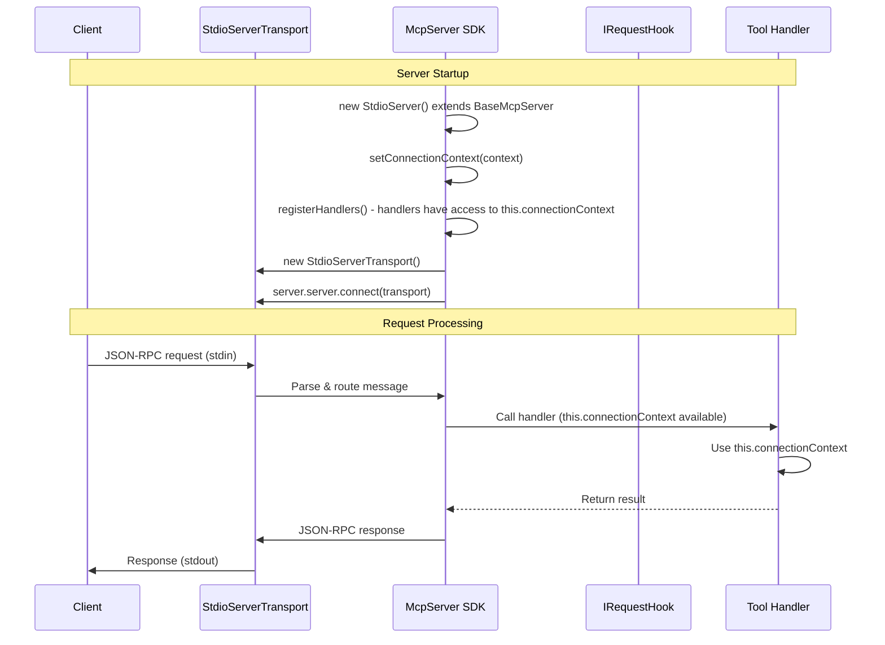
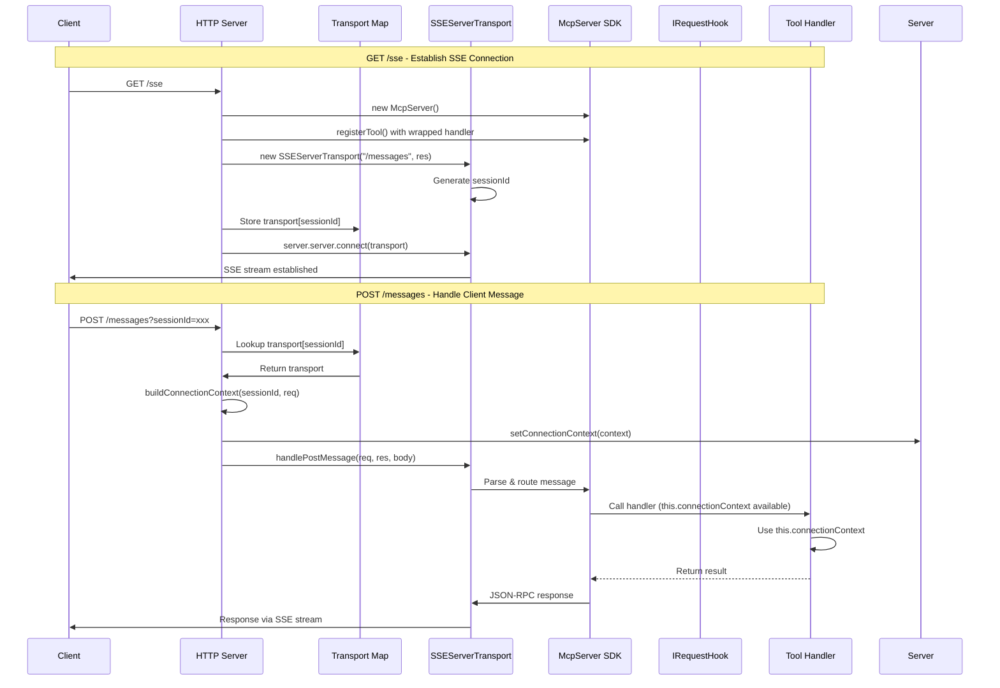
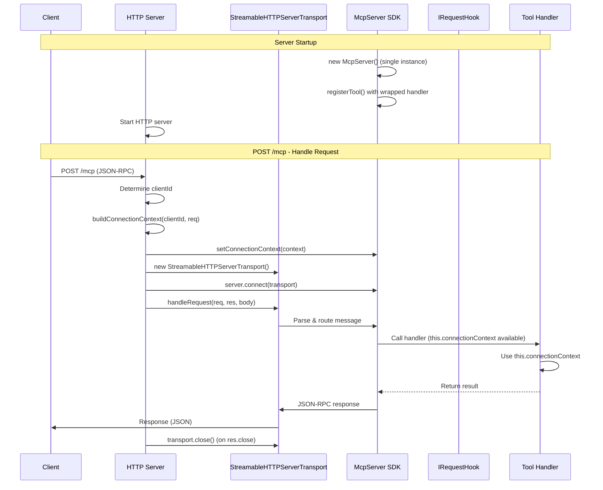

# MCP Server Architecture v2

## Overview

Simple architecture based on `@modelcontextprotocol/sdk` `McpServer` class. Each transport type has its own server class that injects handlers and provides hooks for connection setup.

## Core Architecture

### Base Server Class

Base class that extends `McpServer` from SDK and provides context for handlers:

```typescript
abstract class BaseMcpServer extends McpServer {
  protected connectionContext: ConnectionContext | null = null;
  
  constructor(options: { name: string; version: string }) {
    super(options);
  }
  
  /**
   * Sets connection context (called before connecting transport)
   * For stdio: called once on startup
   * For SSE/HTTP: called per-request
   */
  protected setConnectionContext(context: ConnectionContext): void {
    this.connectionContext = context;
  }
  
  /**
   * Gets current connection context
   * Handlers can access this via `this.connectionContext` in their class
   */
  protected getConnectionContext(): ConnectionContext | null {
    return this.connectionContext;
  }
  
  /**
   * Registers handlers from registry
   * Handlers will have access to `this.connectionContext`
   */
  protected registerHandlers(handlersRegistry: IHandlersRegistry): void {
    handlersRegistry.registerAllTools(this);
  }
}

interface ConnectionContext {
  // Connection parameters to ABAP system
  connectionParams?: {
    sapUrl: string;
    auth: {
      type: 'jwt' | 'basic';
      jwtToken?: string;
      username?: string;
      password?: string;
    };
    client?: string;
  };
  
  // Session information
  sessionId: string;
  
  // Additional metadata
  metadata?: Record<string, any>;
}
```

## Server Classes

### StdioServer

**Pattern**: Single global server instance, one transport, connection setup on startup

```typescript
class StdioServer extends BaseMcpServer {
  constructor(
    private handlersRegistry: IHandlersRegistry
  ) {
    super({
      name: "mcp-abap-adt",
      version: "1.0.0",
    });
  }
  
  async start(connectionContext: ConnectionContext): Promise<void> {
    // 1. Set connection context (available in handlers via this.connectionContext)
    this.setConnectionContext(connectionContext);
    
    // 2. Register handlers from registry
    // Handlers will have access to this.connectionContext
    this.registerHandlers(this.handlersRegistry);
    
    // 3. Create transport
    const transport = new StdioServerTransport();
    
    // 4. Connect transport to server
    await this.server.connect(transport);
  }
}
```

**Flow**:
- Create `StdioServer` instance (extends `BaseMcpServer` which extends `McpServer`)
- Set connection context via `setConnectionContext()` (available as `this.connectionContext`)
- Register handlers from `IHandlersRegistry` via `registerHandlers()`
- Handlers can access context via `this.connectionContext` in their class
- Create `StdioServerTransport` and connect
- SDK handles all requests automatically

**Sequence Diagram**:



### SseServer

**Pattern**: HTTP server with GET endpoint for SSE stream, POST endpoint for messages, per-request server instance

```typescript
class SseServer {
  private transports: { [sessionId: string]: SSEServerTransport } = {};
  
  constructor(
    private handlersRegistry: IHandlersRegistry,
    private port: number = 8084
  ) {}
  
  async start(): Promise<void> {
    const app = express();
    
    // GET /sse - create SSE connection
    app.get("/sse", async (req, res) => {
      // Create new server instance for this session (extends BaseMcpServer)
      const server = new (class extends BaseMcpServer {
        constructor() {
          super({ name: "mcp-abap-adt-sse", version: "1.0.0" });
        }
      })();
      
      // Register handlers from registry
      server.registerHandlers(this.handlersRegistry);
      
      // Create SSE transport
      const transport = new SSEServerTransport("/messages", res);
      const sessionId = transport.sessionId;
      
      // Store transport in map
      this.transports[sessionId] = transport;
      
      // Connect transport to server
      await server.server.connect(transport);
      
      // Cleanup on close
      res.on("close", () => {
        delete this.transports[sessionId];
        server.server.close();
      });
    });
    
    // POST /messages - handle client messages
    app.post("/messages", async (req, res) => {
      const sessionId = req.query.sessionId as string;
      const transport = this.transports[sessionId];
      
      if (!transport) {
        res.status(400).json({ error: "Invalid sessionId" });
        return;
      }
      
      // Setup connection context from request
      // Note: We need to get server instance - this requires storing server in map too
      // For now, simplified: context is set per-request before handlePostMessage
      const connectionContext = await this.buildConnectionContext(sessionId, req);
      
      // Set context on server instance (if we stored it)
      // Then handle message through transport
      await transport.handlePostMessage(req, res, req.body);
    });
    
    app.listen(this.port);
  }
  
  private async buildConnectionContext(sessionId: string, req: any): Promise<ConnectionContext> {
    // Build connection context from request
    // This will be used to set context on server instance
    return {
      sessionId,
      connectionParams: {
        // Extract from req.headers or req.body
      },
    };
  }
}
```

**Flow**:
- Start HTTP server
- **GET /sse**: For each request, create new server instance (extends `BaseMcpServer`), register handlers, create `SSEServerTransport`, store in map, connect
- **POST /messages**: Look up transport by `sessionId`, build connection context from request, set on server instance, call `transport.handlePostMessage()`
- Connection context is available in handlers via `this.connectionContext`

**Sequence Diagram**:



### StreamableHttpServer

**Pattern**: HTTP server with POST endpoint, per-request transport, single server instance

```typescript
class StreamableHttpServer extends BaseMcpServer {
  constructor(
    private handlersRegistry: IHandlersRegistry,
    private port: number = 8083
  ) {
    super({
      name: "mcp-abap-adt",
      version: "1.0.0",
    });
  }
  
  async start(): Promise<void> {
    // Register handlers from registry
    this.registerHandlers(this.handlersRegistry);
    
    // HTTP server setup
    const app = express();
    app.use(express.json());
    
    // POST /mcp - handle requests
    app.post("/mcp", async (req, res) => {
      const clientId = `${req.socket.remoteAddress}:${req.socket.remotePort}`;
      
      // Setup connection context from request
      const connectionContext = await this.buildConnectionContext(clientId, req);
      this.setConnectionContext(connectionContext);
      
      try {
        // Create new transport for each request
        const transport = new StreamableHTTPServerTransport({
          sessionIdGenerator: undefined,
          enableJsonResponse: true,
        });
        
        // Cleanup on close
        res.on("close", () => {
          transport.close();
        });
        
        // Connect transport to server
        await this.connect(transport);
        
        // Handle request (handlers have access to this.connectionContext)
        await transport.handleRequest(req, res, req.body);
      } catch (error) {
        // Error handling
        throw error;
      }
    });
    
    app.listen(this.port);
  }
  
  private async buildConnectionContext(clientId: string, req: any): Promise<ConnectionContext> {
    // Build connection context from request
    return {
      sessionId: clientId,
      connectionParams: {
        // Extract from req.headers or req.body
      },
    };
  }
}
```

**Flow**:
- Create `StreamableHttpServer` instance (extends `BaseMcpServer` which extends `McpServer`)
- Register handlers from `IHandlersRegistry` via `registerHandlers()`
- Start HTTP server
- **POST /mcp**: For each request, determine `clientId`, build connection context, set via `setConnectionContext()`, create new `StreamableHTTPServerTransport`, connect, call `handleRequest`
- Connection context is available in handlers via `this.connectionContext`

**Sequence Diagram**:



## Handler Registration System

The architecture uses the existing handler registration system:

- **`IHandlersRegistry`**: Interface for handler registry
  - `registerAllTools(server: McpServer)`: Registers all tools on MCP server
  - `getRegisteredTools()`: Gets list of registered tool names
  
- **`CompositeHandlersRegistry`**: Implementation that works with handler groups
  - `getHandlerGroups()`: Returns array of `IHandlerGroup` instances
  - Accepts handler groups via constructor or `addHandlerGroup()`
  
- **`IHandlerGroup`**: Interface for handler groups
  - `getName()`: Returns group name
  - `getHandlers()`: Returns array of `HandlerEntry` (tool definition + handler)
  - `registerHandlers(server: McpServer)`: Registers handlers directly on server

**Handler Groups**:
- `ReadOnlyHandlersGroup`: Read-only operations
- `HighLevelHandlersGroup`: High-level operations
- `LowLevelHandlersGroup`: Low-level operations
- `SystemHandlersGroup`: System operations
- `SearchHandlersGroup`: Search operations

## Key Points

1. **BaseMcpServer Class**: Extends `McpServer` from SDK and provides `connectionContext` property
   - Handlers can access context via `this.connectionContext` in their class
   - Context is set via `setConnectionContext()` method
   
2. **Three Server Classes**: 
   - `StdioServer` extends `BaseMcpServer` - single instance, context set once on startup
   - `SseServer` - creates new server instance per GET /sse request
   - `StreamableHttpServer` extends `BaseMcpServer` - single instance, context set per-request
   
3. **Handler Registration**: 
   - `IHandlersRegistry` (typically `CompositeHandlersRegistry`) is injected into each server class
   - Handlers are registered via `registerHandlers()` which calls `handlersRegistry.registerAllTools(this)`
   - Handlers have access to `this.connectionContext` in their class
   
4. **Connection Setup**: 
   - For stdio: context set once via `setConnectionContext()` before connecting transport
   - For SSE/HTTP: context built from request and set via `setConnectionContext()` per-request
   
5. **Context Access**: Connection parameters are accessed in handlers via `this.connectionContext` property
