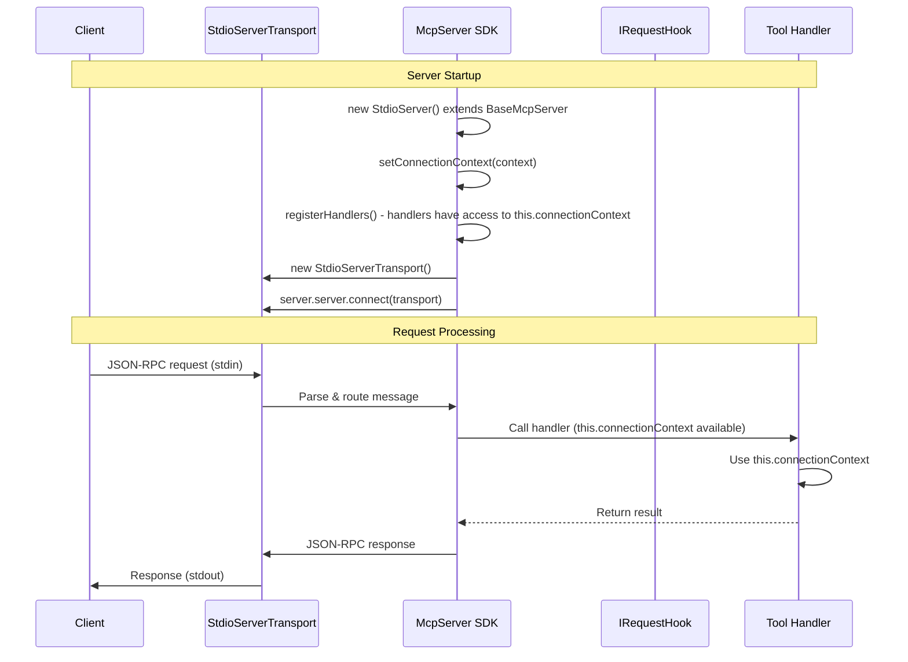
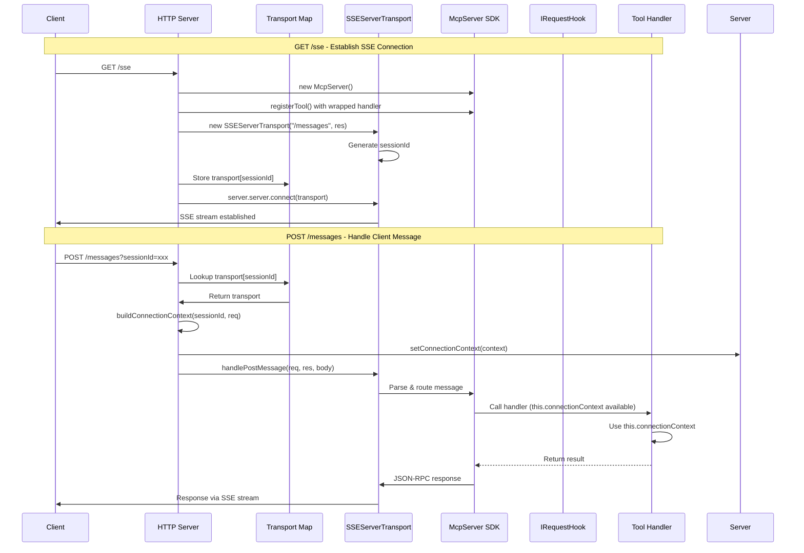
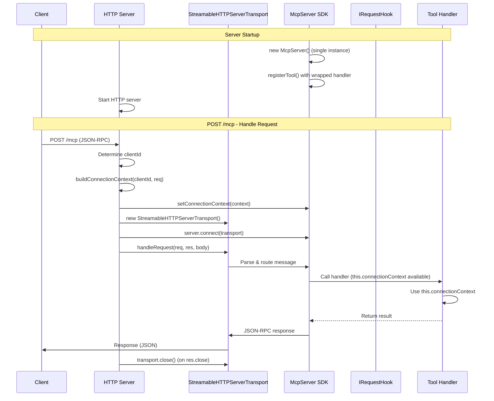

# MCP Server Architecture v2

## Overview

Simple architecture based on `@modelcontextprotocol/sdk` `McpServer` class. Each transport type has its own server class that injects handlers and provides hooks for connection setup.

## Core Architecture

### Base Server Class

Base class that extends `McpServer` from SDK and provides context for handlers:

```typescript
abstract class BaseMcpServer extends McpServer {
  protected connectionContext: ConnectionContext | null = null;
  protected authBroker?: AuthBroker; // From @mcp-abap-adt/auth-broker
  
  constructor(options: { name: string; version: string }) {
    super(options);
  }
  
  /**
   * Sets connection context using auth broker
   * For stdio: called once on startup
   * For SSE/HTTP: called per-request
   */
  protected async setConnectionContext(
    destination: string,
    authBroker: AuthBroker
  ): Promise<void> {
    this.authBroker = authBroker;
    
    // Get connection parameters from broker
    const token = await authBroker.getToken(destination);
    const serviceKey = authBroker.getServiceKey(destination);
    
    this.connectionContext = {
      sessionId: destination,
      connectionParams: {
        sapUrl: serviceKey.sapUrl,
        auth: {
          type: 'jwt',
          jwtToken: token,
        },
        client: serviceKey.client,
      },
    };
  }
  
  /**
   * Gets current connection context
   * Handlers can access this via `this.connectionContext` in their class
   */
  protected getConnectionContext(): ConnectionContext | null {
    return this.connectionContext;
  }
  
  /**
   * Gets ABAP connection from connection context
   * Creates connection using connectionParams from context
   */
  protected getConnection(): AbapConnection {
    if (!this.connectionContext?.connectionParams) {
      throw new Error('Connection context not set');
    }
    
    // Create ABAP connection from context
    return createAbapConnection(this.connectionContext.connectionParams);
  }
  
  /**
   * Registers handlers from registry
   * Wraps handlers to inject connection as first parameter
   * Handlers signature: (connection: AbapConnection, args: any) => Promise<any>
   * Registered as: (args: any) => handler(getConnection(), args)
   */
  protected registerHandlers(handlersRegistry: IHandlersRegistry): void {
    // Get handler groups from registry
    if (handlersRegistry instanceof CompositeHandlersRegistry) {
      const groups = handlersRegistry.getHandlerGroups();
      
      for (const group of groups) {
        const handlers = group.getHandlers();
        for (const entry of handlers) {
          // Wrap handler to inject connection from context
          // Original handler: (connection: AbapConnection, args: any) => Promise<any>
          // Wrapped handler: (args: any) => handler(getConnection(), args)
          const wrappedHandler = async (args: any) => {
            // Get connection from context (this.connectionContext)
            const connection = this.getConnection();
            
            // Call original handler with connection as first parameter
            return await entry.handler(connection, args);
          };
          
          // Register wrapped handler
          this.registerTool(
            entry.toolDefinition.name,
            entry.toolDefinition,
            wrappedHandler
          );
        }
      }
    } else {
      // Fallback: use registerAllTools directly (handlers won't have connection injected)
      handlersRegistry.registerAllTools(this);
    }
  }
}

interface ConnectionContext {
  // Connection parameters to ABAP system
  connectionParams?: {
    sapUrl: string;
    auth: {
      type: 'jwt' | 'basic';
      jwtToken?: string;
      username?: string;
      password?: string;
    };
    client?: string;
  };
  
  // Session information
  sessionId: string;
  
  // Additional metadata
  metadata?: Record<string, any>;
}
```

### Configuration

Server can be configured via:
1. **CLI arguments**: `--mcp=destination --config=path/to/config.yaml`
2. **YAML config file**: Contains service keys, destinations, etc.

```yaml
# config.yaml
destinations:
  trial:
    serviceKey: /path/to/service-key.json
    sapUrl: https://your-system.sap.com
  production:
    serviceKey: /path/to/prod-key.json
    sapUrl: https://prod-system.sap.com
```

### Auth Broker Setup

Auth broker is created from configuration and used to get connection context:

```typescript
// Create auth broker from service key store
const serviceKeyStore = new AbapServiceKeyStore(config.serviceKeysPath);
const sessionStore = new AbapSessionStore();
const tokenProvider = new AuthorizationCodeProvider({
  uaaUrl: 'https://auth.example.com',
  clientId: '...',
  clientSecret: '...',
  browser: 'system',
});

const authBrokerFactory = new AuthBrokerFactory(
  serviceKeyStore,
  sessionStore,
  tokenProvider
);

// Get or create broker for destination
const authBroker = authBrokerFactory.getOrCreateBroker(destination);
```

## Server Classes

### StdioServer

**Pattern**: Single global server instance, one transport, connection setup on startup

```typescript
class StdioServer extends BaseMcpServer {
  constructor(
    private handlersRegistry: IHandlersRegistry,
    private authBroker: AuthBroker
  ) {
    super({
      name: "mcp-abap-adt",
      version: "1.0.0",
    });
  }
  
  async start(destination: string): Promise<void> {
    // 1. Set connection context using auth broker
    // Context is available in handlers via this.connectionContext
    await this.setConnectionContext(destination, this.authBroker);
    
    // 2. Register handlers from registry
    // Handlers will have access to this.connectionContext
    this.registerHandlers(this.handlersRegistry);
    
    // 3. Create transport
    const transport = new StdioServerTransport();
    
    // 4. Connect transport to server
    await this.server.connect(transport);
  }
}
```

**Usage**:
```typescript
// From CLI: --mcp=trial
// Or from YAML config
const destination = args.mcp || config.defaultDestination;

// Create auth broker (from config or CLI)
const authBroker = authBrokerFactory.getOrCreateBroker(destination);

// Create and start server
const server = new StdioServer(handlersRegistry, authBroker);
await server.start(destination);
```

**Flow**:
- Create `StdioServer` instance (extends `BaseMcpServer` which extends `McpServer`)
- Inject `IHandlersRegistry` and `AuthBroker`
- Call `start(destination)` where destination comes from CLI (`--mcp=...`) or YAML config
- `setConnectionContext()` uses auth broker to get token and service key
- Context is available as `this.connectionContext` in handlers
- Register handlers from `IHandlersRegistry` via `registerHandlers()`
- Create `StdioServerTransport` and connect
- SDK handles all requests automatically

**Sequence Diagram**:



### SseServer

**Pattern**: HTTP server with GET endpoint for SSE stream, POST endpoint for messages, per-request server instance

```typescript
class SseServer {
  private transports: { [sessionId: string]: SSEServerTransport } = {};
  
  constructor(
    private handlersRegistry: IHandlersRegistry,
    private port: number = 8084
  ) {}
  
  async start(): Promise<void> {
    const app = express();
    
    // GET /sse - create SSE connection
    app.get("/sse", async (req, res) => {
      // Create new server instance for this session (extends BaseMcpServer)
      const server = new (class extends BaseMcpServer {
        constructor() {
          super({ name: "mcp-abap-adt-sse", version: "1.0.0" });
        }
      })();
      
      // Register handlers from registry
      server.registerHandlers(this.handlersRegistry);
      
      // Create SSE transport
      const transport = new SSEServerTransport("/messages", res);
      const sessionId = transport.sessionId;
      
      // Store transport in map
      this.transports[sessionId] = transport;
      
      // Connect transport to server
      await server.server.connect(transport);
      
      // Cleanup on close
      res.on("close", () => {
        delete this.transports[sessionId];
        server.server.close();
      });
    });
    
    // POST /messages - handle client messages
    app.post("/messages", async (req, res) => {
      const sessionId = req.query.sessionId as string;
      const transport = this.transports[sessionId];
      
      if (!transport) {
        res.status(400).json({ error: "Invalid sessionId" });
        return;
      }
      
      // Setup connection context from request
      // Note: We need to get server instance - this requires storing server in map too
      // For now, simplified: context is set per-request before handlePostMessage
      const connectionContext = await this.buildConnectionContext(sessionId, req);
      
      // Set context on server instance (if we stored it)
      // Then handle message through transport
      await transport.handlePostMessage(req, res, req.body);
    });
    
    app.listen(this.port);
  }
  
  private async buildConnectionContext(sessionId: string, req: any): Promise<ConnectionContext> {
    // Build connection context from request
    // This will be used to set context on server instance
    return {
      sessionId,
      connectionParams: {
        // Extract from req.headers or req.body
      },
    };
  }
}
```

**Flow**:
- Start HTTP server
- **GET /sse**: For each request, create new server instance (extends `BaseMcpServer`), register handlers, create `SSEServerTransport`, store in map, connect
- **POST /messages**: Look up transport by `sessionId`, build connection context from request, set on server instance, call `transport.handlePostMessage()`
- Connection context is available in handlers via `this.connectionContext`

**Sequence Diagram**:



### StreamableHttpServer

**Pattern**: HTTP server with POST endpoint, per-request transport, single server instance

```typescript
class StreamableHttpServer extends BaseMcpServer {
  constructor(
    private handlersRegistry: IHandlersRegistry,
    private authBrokerFactory: AuthBrokerFactory,
    private port: number = 8083
  ) {
    super({
      name: "mcp-abap-adt",
      version: "1.0.0",
    });
  }
  
  async start(): Promise<void> {
    // Register handlers from registry
    this.registerHandlers(this.handlersRegistry);
    
    // HTTP server setup
    const app = express();
    app.use(express.json());
    
    // POST /mcp - handle requests
    app.post("/mcp", async (req, res) => {
      const clientId = `${req.socket.remoteAddress}:${req.socket.remotePort}`;
      
      // Get destination from request (headers or body)
      const destination = req.headers['x-destination'] || req.body?.destination || 'default';
      
      // Get or create auth broker for this destination
      const authBroker = this.authBrokerFactory.getOrCreateBroker(destination);
      
      // Setup connection context using auth broker
      await this.setConnectionContext(destination, authBroker);
      
      try {
        // Create new transport for each request
        const transport = new StreamableHTTPServerTransport({
          sessionIdGenerator: undefined,
          enableJsonResponse: true,
        });
        
        // Cleanup on close
        res.on("close", () => {
          transport.close();
        });
        
        // Connect transport to server
        await this.connect(transport);
        
        // Handle request (handlers have access to this.connectionContext)
        await transport.handleRequest(req, res, req.body);
      } catch (error) {
        // Error handling
        throw error;
      }
    });
    
    app.listen(this.port);
  }
}
```

**Usage**:
```typescript
// From CLI: --port=8083
// Or from YAML config
const port = args.port || config.port || 8083;

// Create auth broker factory (from config)
const authBrokerFactory = createAuthBrokerFactory(config);

// Create and start server
const server = new StreamableHttpServer(handlersRegistry, authBrokerFactory, port);
await server.start();
```

**Flow**:
- Create `StreamableHttpServer` instance (extends `BaseMcpServer` which extends `McpServer`)
- Inject `IHandlersRegistry` and `AuthBrokerFactory`
- Register handlers from `IHandlersRegistry` via `registerHandlers()`
- Start HTTP server
- **POST /mcp**: For each request, get destination from headers/body, get auth broker from factory, set connection context via `setConnectionContext()`, create new `StreamableHTTPServerTransport`, connect, call `handleRequest`
- Connection context is available in handlers via `this.connectionContext`

**Sequence Diagram**:



## Handler Registration System

The architecture uses the existing handler registration system:

- **`IHandlersRegistry`**: Interface for handler registry
  - `registerAllTools(server: McpServer)`: Registers all tools on MCP server
  - `getRegisteredTools()`: Gets list of registered tool names
  
- **`CompositeHandlersRegistry`**: Implementation that works with handler groups
  - `getHandlerGroups()`: Returns array of `IHandlerGroup` instances
  - Accepts handler groups via constructor or `addHandlerGroup()`
  
- **`IHandlerGroup`**: Interface for handler groups
  - `getName()`: Returns group name
  - `getHandlers()`: Returns array of `HandlerEntry` (tool definition + handler)
  - `registerHandlers(server: McpServer)`: Registers handlers directly on server

**Handler Groups**:
- `ReadOnlyHandlersGroup`: Read-only operations
- `HighLevelHandlersGroup`: High-level operations
- `LowLevelHandlersGroup`: Low-level operations
- `SystemHandlersGroup`: System operations
- `SearchHandlersGroup`: Search operations

## Handler Registration with Connection Injection

### Handler Signature

Handlers have `connection` as first parameter, which is automatically injected during registration:

```typescript
// Handler signature
type ToolHandler = (connection: AbapConnection, args: any) => Promise<any>;

// Example handler
async function handleCreateClass(
  connection: AbapConnection,  // Injected automatically
  args: { className: string; package: string }
): Promise<any> {
  // Use connection directly
  const result = await connection.createClass(args.className, args.package);
  return result;
}
```

### Registration Process

During registration, handlers are wrapped to inject connection from context:

```typescript
protected registerHandlers(handlersRegistry: IHandlersRegistry): void {
  if (handlersRegistry instanceof CompositeHandlersRegistry) {
    const groups = handlersRegistry.getHandlerGroups();
    
    for (const group of groups) {
      const handlers = group.getHandlers();
      for (const entry of handlers) {
        // Wrap handler to inject connection
        // Original: (connection, args) => Promise<any>
        // Wrapped: (args) => handler(getConnection(), args)
        const wrappedHandler = async (args: any) => {
          // Get connection from this.connectionContext
          const connection = this.getConnection();
          
          // Call original handler with connection as first parameter
          return await entry.handler(connection, args);
        };
        
        this.registerTool(
          entry.toolDefinition.name,
          entry.toolDefinition,
          wrappedHandler
        );
      }
    }
  }
}
```

### Why This Works

- **One McpServer per request**: For stdio (one server), SSE (one server per GET /sse), HTTP (one server per POST)
- **Context is per-server**: Each server instance has its own `this.connectionContext`
- **Connection is fresh**: `getConnection()` creates connection from current context for each request
- **No manual connection management**: Handlers don't need to get connection themselves

### Example Handler Implementation

```typescript
// src/handlers/class/high/handleCreateClass.ts
export async function handleCreateClass(
  connection: AbapConnection,  // Automatically injected
  args: {
    className: string;
    package: string;
    description?: string;
  }
): Promise<any> {
  // Connection is already available, no need to create it
  const result = await connection.createClass({
    name: args.className,
    package: args.package,
    description: args.description,
  });
  
  return {
    content: [
      {
        type: 'text',
        text: `Class ${args.className} created successfully`,
      },
    ],
  };
}
```

## Key Points

1. **BaseMcpServer Class**: Extends `McpServer` from SDK and provides `connectionContext` property
   - Handlers can access context via `this.connectionContext` in their class
   - Context is set via `setConnectionContext(destination, authBroker)` which uses auth broker to get token and service key
   - Handlers can be wrapped during registration to bind to class instance, or defined as class methods
   
2. **Three Server Classes**: 
   - `StdioServer` extends `BaseMcpServer` - single instance, context set once on startup using destination from CLI/YAML
   - `SseServer` - creates new server instance per GET /sse request
   - `StreamableHttpServer` extends `BaseMcpServer` - single instance, context set per-request using destination from request
   
3. **Handler Registration**: 
   - `IHandlersRegistry` (typically `CompositeHandlersRegistry`) is injected into each server class
   - Handlers have signature: `(connection: AbapConnection, args: any) => Promise<any>`
   - During registration, handlers are wrapped to inject `connection` from `this.connectionContext`
   - Wrapped handler: `(args: any) => handler(getConnection(), args)`
   - Each request gets fresh connection from current context
   
4. **Configuration**: 
   - CLI arguments: `--mcp=destination`, `--port=8083`, `--config=path/to/config.yaml`
   - YAML config file: Contains destinations, service keys paths, etc.
   - Configuration is used to create `AuthBrokerFactory` and get `AuthBroker` instances
   
5. **Auth Broker**: 
   - Created from `AuthBrokerFactory` using service key store, session store, and token provider
   - Used in `setConnectionContext()` to get JWT token and service key for destination
   - For stdio: one broker per destination (from CLI/YAML)
   - For HTTP: broker retrieved per-request based on destination from request headers/body
   
6. **Connection Setup**: 
   - For stdio: context set once via `setConnectionContext(destination, authBroker)` before connecting transport
   - For SSE/HTTP: destination extracted from request, broker retrieved from factory, context set via `setConnectionContext()` per-request
   
7. **Context Access**: Connection parameters are accessed in handlers via `this.connectionContext` property
